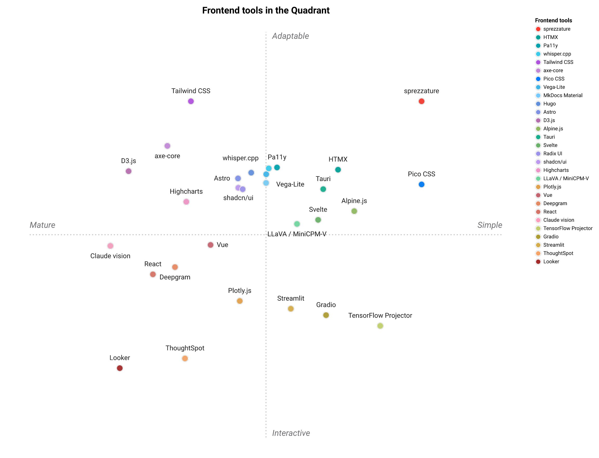

# Landscape — alternatives to `sprezzature`

`sprezzature` is one opinionated answer to a wide question: *how should a large language model (LLM) produce frontend code?* This file maps the alternatives in every category the `sprezzature-*` skills touch as **matrices**: rows are tools, columns are characteristics you actually care about. Use it to choose with eyes open.

## A note on bias

This file is written by the author of `sprezzature`. The "Skill alignment" column is **not a quality score**; it flags whether each alternative fits inside `sprezzature`'s emitted output (vanilla JavaScript (JS), Tailwind, no framework runtime). Most alternatives marked ✗ are excellent at what they do; the mark just means "different design choice, not a drop-in companion." Read the Notes column and the "Pick X when…" paragraph after each table for the honest one-liner. If you came here looking for "is `sprezzature` better?" the answer is **almost never in absolute terms; only better for a few specific shapes of project**, named below.

## Where `sprezzature` is genuinely the best pick

Three concrete categories where the `sprezzature-*` skills together do something no other listed tool does in skill form:

1. **Command-line-interface (CLI) → graphical-user-interface (GUI) mock-ups from `tool --help`.** `sprezzature-cli-gui` scaffolds a vanilla-JS + Tailwind GUI from a Python / Node / Go CLI's argument parser, in skill form, with no runtime framework. No other listed tool does this as a Claude / OpenCode skill: Gradio / Streamlit / Gooey produce a runtime UI you cannot easily restyle and are not skills.
2. **Pre-ship accessibility (a11y) gates in continuous integration (CI) without a headless browser.** `sprezzature-accessibility/scripts/lint_a11y.py` is a single-file, stdlib-only Python lint that runs in milliseconds in any minimal CI container. axe-core / Pa11y / Lighthouse are the right answer for runtime audits (and you should run both), but neither runs without a browser, and that is a real cost in a pre-commit hook.
3. **Bilingual EN/FR (or EN/DE, EN/ES, EN/JA) documentation sites where typography and tone parity matter.** `sprezzature-publish` + `sprezzature-ui`'s plain-language rewriter + `i18n.md` route together. No single static-site generator (SSG) ships this combination.

## Where to pick something else

Honest defaults for the categories where another tool wins outright:

- **React / Vue / Svelte component-library workflow** → **[shadcn/ui](https://ui.shadcn.com)**. Same copy-paste philosophy as `sprezzature`, but framework-native, far larger audience, far more components. `sprezzature` deliberately refuses to emit framework code; if your team has picked React, fighting `sprezzature` is the wrong move.
- **True zero-build story for content-driven sites** → **[HTMX](https://htmx.org) + a classless Cascading Style Sheets (CSS) framework (e.g. [Pico CSS](https://picocss.com), [Simple.css](https://simplecss.org))**. HTMX needs no build, classless CSS needs no build, the resulting HyperText Markup Language (HTML) is the smallest realistic deliverable. `sprezzature` claims "zero build" only on the prototype path (Tailwind Play CDN); HTMX + Pico is zero build in production too.
- **Large versioned documentation sites (100+ pages, per-release views)** → **[MkDocs Material](https://squidfunk.github.io/mkdocs-material/), [Hugo](https://gohugo.io), [Astro](https://astro.build), or [Docusaurus](https://docusaurus.io)**. `sprezzature-publish` is sized for ≤ 30 pages.
- **Hosted top-quality alt-text** → **Claude vision, GPT-4o (generative pre-trained transformer) vision, Gemini Vision**. `sprezzature-vision/scripts/alt_from_ollama.py` is the right pick when locality / cost / privacy matter; hosted models are noticeably better on the long tail.
- **Live captions, sub-real-time turnaround** → **Deepgram, AssemblyAI**.

Most other categories: there is a better tool if you specialise. The matrices below name it explicitly.

## Legend

- **✓** yes / built-in
- **~** partial / requires config
- **✗** no
- **N/A** doesn't apply to this row's category

Costs are Massachusetts Institute of Technology (MIT)/Apache-permissive unless otherwise noted. Stack column lists the language a developer of the tool writes against, not the underlying engine.

## Competitive positioning — one table

`sprezzature` is one opinionated answer; this is where it **stands** against the alternatives.
Rows are projects, columns are criteria, each cell rated **1–5 ⭐️** (all higher-is-better).
The ratings are the author's and deliberately honest: `sprezzature` trades ecosystem **maturity**
for light weight, restyleability, accessibility, and skill-native delivery.

| Project | Local-first | Lightweight | Restyleable | Accessibility | Maturity | Skill-native | Interactive | Free/Open | Ease | Ecosystem |
|---|:---:|:---:|:---:|:---:|:---:|:---:|:---:|:---:|:---:|:---:|
| **sprezzature** (the skills) | ⭐️⭐️⭐️⭐️⭐️ | ⭐️⭐️⭐️⭐️⭐️ | ⭐️⭐️⭐️⭐️⭐️ | ⭐️⭐️⭐️⭐️⭐️ | ⭐️⭐️ | ⭐️⭐️⭐️⭐️⭐️ | ⭐️⭐️⭐️⭐️ | ⭐️⭐️⭐️⭐️⭐️ | ⭐️⭐️⭐️⭐️ | ⭐️⭐️ |
| [React](https://react.dev) | ⭐️⭐️⭐️⭐️⭐️ | ⭐️ | ⭐️⭐️⭐️ | ⭐️⭐️ | ⭐️⭐️⭐️⭐️⭐️ | ⭐️ | ⭐️⭐️⭐️⭐️ | ⭐️⭐️⭐️⭐️⭐️ | ⭐️⭐️ | ⭐️⭐️⭐️⭐️⭐️ |
| [Vue](https://vuejs.org) | ⭐️⭐️⭐️⭐️⭐️ | ⭐️⭐️ | ⭐️⭐️⭐️ | ⭐️⭐️⭐️ | ⭐️⭐️⭐️⭐️⭐️ | ⭐️ | ⭐️⭐️⭐️⭐️ | ⭐️⭐️⭐️⭐️⭐️ | ⭐️⭐️⭐️ | ⭐️⭐️⭐️⭐️ |
| [Svelte](https://svelte.dev) | ⭐️⭐️⭐️⭐️⭐️ | ⭐️⭐️⭐️⭐️ | ⭐️⭐️⭐️ | ⭐️⭐️⭐️ | ⭐️⭐️⭐️⭐️ | ⭐️ | ⭐️⭐️⭐️⭐️ | ⭐️⭐️⭐️⭐️⭐️ | ⭐️⭐️⭐️⭐️ | ⭐️⭐️⭐️ |
| [HTMX](https://htmx.org) | ⭐️⭐️⭐️⭐️⭐️ | ⭐️⭐️⭐️⭐️ | ⭐️⭐️⭐️⭐️ | ⭐️⭐️⭐️⭐️ | ⭐️⭐️⭐️ | ⭐️ | ⭐️⭐️⭐️ | ⭐️⭐️⭐️⭐️⭐️ | ⭐️⭐️⭐️⭐️ | ⭐️⭐️⭐️ |
| [Alpine.js](https://alpinejs.dev) | ⭐️⭐️⭐️⭐️⭐️ | ⭐️⭐️⭐️⭐️ | ⭐️⭐️⭐️ | ⭐️⭐️⭐️ | ⭐️⭐️⭐️ | ⭐️ | ⭐️⭐️⭐️ | ⭐️⭐️⭐️⭐️⭐️ | ⭐️⭐️⭐️⭐️ | ⭐️⭐️⭐️ |
| [Tailwind CSS](https://tailwindcss.com) | ⭐️⭐️⭐️⭐️⭐️ | ⭐️⭐️⭐️⭐️ | ⭐️⭐️⭐️⭐️⭐️ | ⭐️⭐️⭐️⭐️ | ⭐️⭐️⭐️⭐️⭐️ | ⭐️⭐️ | ⭐️ | ⭐️⭐️⭐️⭐️⭐️ | ⭐️⭐️⭐️⭐️ | ⭐️⭐️⭐️⭐️⭐️ |
| [Pico CSS](https://picocss.com) | ⭐️⭐️⭐️⭐️⭐️ | ⭐️⭐️⭐️⭐️⭐️ | ⭐️⭐️ | ⭐️⭐️⭐️⭐️ | ⭐️⭐️⭐️ | ⭐️ | ⭐️ | ⭐️⭐️⭐️⭐️⭐️ | ⭐️⭐️⭐️⭐️⭐️ | ⭐️⭐️ |
| [shadcn/ui](https://ui.shadcn.com) | ⭐️⭐️⭐️⭐️⭐️ | ⭐️⭐️⭐️ | ⭐️⭐️⭐️⭐️ | ⭐️⭐️⭐️⭐️ | ⭐️⭐️⭐️⭐️ | ⭐️ | ⭐️⭐️⭐️⭐️ | ⭐️⭐️⭐️⭐️⭐️ | ⭐️⭐️⭐️ | ⭐️⭐️⭐️⭐️ |
| [Radix UI](https://www.radix-ui.com) | ⭐️⭐️⭐️⭐️⭐️ | ⭐️⭐️⭐️ | ⭐️⭐️⭐️ | ⭐️⭐️⭐️⭐️⭐️ | ⭐️⭐️⭐️⭐️ | ⭐️ | ⭐️⭐️⭐️⭐️ | ⭐️⭐️⭐️⭐️⭐️ | ⭐️⭐️⭐️ | ⭐️⭐️⭐️⭐️ |
| [Vega-Lite](https://vega.github.io/vega-lite/) | ⭐️⭐️⭐️⭐️⭐️ | ⭐️⭐️⭐️ | ⭐️⭐️⭐️⭐️ | ⭐️⭐️⭐️⭐️ | ⭐️⭐️⭐️⭐️ | ⭐️⭐️ | ⭐️⭐️⭐️⭐️ | ⭐️⭐️⭐️⭐️⭐️ | ⭐️⭐️⭐️⭐️ | ⭐️⭐️⭐️⭐️ |
| [D3.js](https://d3js.org) | ⭐️⭐️⭐️⭐️⭐️ | ⭐️⭐️⭐️⭐️ | ⭐️⭐️⭐️⭐️⭐️ | ⭐️⭐️⭐️ | ⭐️⭐️⭐️⭐️⭐️ | ⭐️ | ⭐️⭐️⭐️⭐️⭐️ | ⭐️⭐️⭐️⭐️⭐️ | ⭐️ | ⭐️⭐️⭐️⭐️⭐️ |
| [Plotly.js](https://plotly.com/javascript/) | ⭐️⭐️⭐️⭐️⭐️ | ⭐️ | ⭐️⭐️ | ⭐️⭐️⭐️ | ⭐️⭐️⭐️⭐️ | ⭐️ | ⭐️⭐️⭐️⭐️⭐️ | ⭐️⭐️⭐️⭐️ | ⭐️⭐️⭐️ | ⭐️⭐️⭐️⭐️ |
| [Gradio](https://gradio.app) | ⭐️⭐️⭐️⭐️ | ⭐️⭐️ | ⭐️ | ⭐️⭐️⭐️ | ⭐️⭐️⭐️⭐️ | ⭐️ | ⭐️⭐️⭐️⭐️ | ⭐️⭐️⭐️⭐️ | ⭐️⭐️⭐️⭐️⭐️ | ⭐️⭐️⭐️ |
| [Streamlit](https://streamlit.io) | ⭐️⭐️⭐️⭐️ | ⭐️⭐️ | ⭐️ | ⭐️⭐️⭐️ | ⭐️⭐️⭐️⭐️ | ⭐️ | ⭐️⭐️⭐️⭐️ | ⭐️⭐️⭐️⭐️ | ⭐️⭐️⭐️⭐️⭐️ | ⭐️⭐️⭐️⭐️ |
| [Tauri](https://tauri.app) | ⭐️⭐️⭐️⭐️⭐️ | ⭐️⭐️⭐️⭐️ | ⭐️⭐️⭐️⭐️ | ⭐️⭐️⭐️ | ⭐️⭐️⭐️ | ⭐️ | ⭐️⭐️⭐️ | ⭐️⭐️⭐️⭐️⭐️ | ⭐️⭐️⭐️ | ⭐️⭐️⭐️ |
| [Hugo](https://gohugo.io) | ⭐️⭐️⭐️⭐️⭐️ | ⭐️⭐️⭐️⭐️ | ⭐️⭐️⭐️⭐️ | ⭐️⭐️⭐️ | ⭐️⭐️⭐️⭐️ | ⭐️ | ⭐️⭐️ | ⭐️⭐️⭐️⭐️⭐️ | ⭐️⭐️⭐️ | ⭐️⭐️⭐️⭐️ |
| [Astro](https://astro.build) | ⭐️⭐️⭐️⭐️⭐️ | ⭐️⭐️⭐️ | ⭐️⭐️⭐️⭐️ | ⭐️⭐️⭐️⭐️ | ⭐️⭐️⭐️⭐️ | ⭐️ | ⭐️⭐️⭐️ | ⭐️⭐️⭐️⭐️⭐️ | ⭐️⭐️⭐️ | ⭐️⭐️⭐️⭐️ |
| [MkDocs Material](https://squidfunk.github.io/mkdocs-material/) | ⭐️⭐️⭐️⭐️⭐️ | ⭐️⭐️⭐️⭐️ | ⭐️⭐️⭐️ | ⭐️⭐️⭐️⭐️ | ⭐️⭐️⭐️⭐️ | ⭐️ | ⭐️⭐️ | ⭐️⭐️⭐️⭐️ | ⭐️⭐️⭐️⭐️ | ⭐️⭐️⭐️⭐️ |
| [axe-core](https://github.com/dequelabs/axe-core) | ⭐️⭐️⭐️⭐️⭐️ | ⭐️⭐️⭐️⭐️ | ⭐️⭐️⭐️ | ⭐️⭐️⭐️⭐️⭐️ | ⭐️⭐️⭐️⭐️⭐️ | ⭐️ | ⭐️ | ⭐️⭐️⭐️⭐️ | ⭐️⭐️⭐️ | ⭐️⭐️⭐️⭐️⭐️ |
| [Pa11y](https://pa11y.org) | ⭐️⭐️⭐️⭐️⭐️ | ⭐️⭐️⭐️ | ⭐️⭐️⭐️ | ⭐️⭐️⭐️⭐️⭐️ | ⭐️⭐️⭐️⭐️ | ⭐️ | ⭐️ | ⭐️⭐️⭐️⭐️⭐️ | ⭐️⭐️⭐️ | ⭐️⭐️⭐️ |
| [Claude vision](https://docs.claude.com/en/docs/build-with-claude/vision) | ⭐️ | ⭐️⭐️⭐️ | ⭐️⭐️⭐️ | ⭐️⭐️⭐️⭐️ | ⭐️⭐️⭐️⭐️⭐️ | ⭐️⭐️ | ⭐️⭐️ | ⭐️ | ⭐️⭐️⭐️ | ⭐️⭐️⭐️⭐️⭐️ |
| [LLaVA / MiniCPM-V](https://huggingface.co/docs/transformers/model_doc/llava) | ⭐️⭐️⭐️⭐️⭐️ | ⭐️⭐️ | ⭐️⭐️⭐️ | ⭐️⭐️⭐️ | ⭐️⭐️⭐️ | ⭐️ | ⭐️ | ⭐️⭐️⭐️⭐️⭐️ | ⭐️⭐️ | ⭐️⭐️⭐️ |
| [whisper.cpp](https://github.com/ggml-org/whisper.cpp) | ⭐️⭐️⭐️⭐️⭐️ | ⭐️⭐️⭐️⭐️⭐️ | ⭐️⭐️⭐️ | ⭐️⭐️⭐️ | ⭐️⭐️⭐️⭐️ | ⭐️ | ⭐️ | ⭐️⭐️⭐️⭐️⭐️ | ⭐️⭐️⭐️ | ⭐️⭐️⭐️⭐️ |
| [Deepgram](https://deepgram.com) | ⭐️ | ⭐️⭐️⭐️ | ⭐️⭐️⭐️ | ⭐️⭐️⭐️⭐️ | ⭐️⭐️⭐️⭐️ | ⭐️ | ⭐️⭐️ | ⭐️ | ⭐️⭐️⭐️ | ⭐️⭐️⭐️⭐️ |
| [Looker](https://cloud.google.com/looker) | ⭐️ | ⭐️ | ⭐️⭐️ | ⭐️⭐️⭐️ | ⭐️⭐️⭐️⭐️⭐️ | ⭐️ | ⭐️⭐️⭐️⭐️⭐️ | ⭐️ | ⭐️⭐️ | ⭐️⭐️⭐️⭐️ |
| [ThoughtSpot](https://www.thoughtspot.com) | ⭐️⭐️ | ⭐️ | ⭐️⭐️ | ⭐️⭐️⭐️ | ⭐️⭐️⭐️⭐️ | ⭐️ | ⭐️⭐️⭐️⭐️⭐️ | ⭐️ | ⭐️⭐️⭐️ | ⭐️⭐️⭐️⭐️ |
| [Highcharts](https://www.highcharts.com) | ⭐️⭐️⭐️⭐️⭐️ | ⭐️⭐️⭐️ | ⭐️⭐️⭐️⭐️ | ⭐️⭐️⭐️⭐️⭐️ | ⭐️⭐️⭐️⭐️⭐️ | ⭐️ | ⭐️⭐️⭐️⭐️⭐️ | ⭐️⭐️ | ⭐️⭐️⭐️⭐️ | ⭐️⭐️⭐️⭐️ |
| [TensorFlow Embedding Projector](https://projector.tensorflow.org) | ⭐️⭐️⭐️⭐️ | ⭐️⭐️⭐️ | ⭐️ | ⭐️⭐️ | ⭐️⭐️⭐️ | ⭐️ | ⭐️⭐️⭐️⭐️⭐️ | ⭐️⭐️⭐️⭐️⭐️ | ⭐️⭐️⭐️ | ⭐️⭐️ |

**On locality:** `sprezzature` is **local-first**, as is most tooling that runs on your machine — but no
longer all of it: the hosted business-intelligence (BI) platforms (Looker, ThoughtSpot) and the online
artificial-intelligence (AI) services (Claude vision, Deepgram) are not. With those entrants the column
now **discriminates**, so it joins the map as a full criterion rather than sitting out as near-constant context.

Fed as integers to [standpoint](https://github.com/warith-harchaoui/standingpoint) (with `sprezzature`
as the reference row), the ten criteria project onto a 2-D **positioning map**:

The horizontal axis contrasts **Mature** (left: established maturity and ecosystem) with **Simple**
(right: immediate to pick up); the vertical contrasts **Adaptable** (top: restyleable and lightweight)
with **Interactive** (bottom: interactive end-user exploration): together ~55% of what separates these
approaches. `sprezzature` anchors the top-right; **Looker** sits diametrically opposite (a hosted,
heavyweight, proprietary BI platform); **Tailwind CSS** reaches furthest toward Adaptable and **Pico CSS**
furthest toward Simple. The scores live in a **gitignored** comma-separated-values (CSV) file
(`.private/landscape/landscape-en.csv`); regenerate the map with
`standpoint .private/landscape/landscape-en.csv -r sprezzature -o out --model qwen3-vl:8b`.

The per-category matrices below keep the columns that only make sense within one category.

---

## Quick pick

What kind of work are you doing? Find the row and the honest recommendation.

| You want… | `sprezzature` skill | When to pick something else |
|---|---|---|
| Vanilla JS + Tailwind user-interface (UI) output, no framework | `sprezzature-ui` | If the team has already picked React/Vue/Svelte. `sprezzature` refuses to emit framework code; you'd be fighting it. |
| React + design system stack | none | [shadcn/ui](https://ui.shadcn.com), [Mantine](https://mantine.dev), [Material UI (MUI)](https://mui.com). shadcn is closest in philosophy (copy-paste, no runtime lock-in). |
| Material-3 native look | none | [Material Web Components](https://material-web.dev) for first-party Material; `sprezzature-ui/references/material-design.md` only maps Material roles into the skill's tokens. |
| Wrap a Python / Node / Go CLI in a web GUI | `sprezzature-cli-gui` | If you want auto-form-from-signature with no UI control: [Gradio](https://gradio.app) (machine-learning (ML) demos), [Streamlit](https://streamlit.io) (data apps), [Taipy](https://taipy.io). `sprezzature-cli-gui` scaffolds plain HTML you edit; those tools give you a runtime UI you cannot easily restyle. |
| Wrap a CLI as a native desktop app binary | `sprezzature-cli-gui` (UI) + Tauri (shell) | [Tauri](https://tauri.app) is the desktop shell; `sprezzature-cli-gui` emits what goes inside the web view. If you only need the desktop, Tauri's defaults are fine. |
| Build a docs site from a small README + `docs/` | `sprezzature-publish` | For 100+ versioned pages or for a docs site with side-by-side per-release views: [MkDocs Material](https://squidfunk.github.io/mkdocs-material/), [Hugo](https://gohugo.io), [Astro](https://astro.build), [Docusaurus](https://docusaurus.io). `sprezzature-publish` is for small projects (< 30 pages). |
| Declarative JavaScript Object Notation (JSON) charts with a house style | `sprezzature-ui` | For bespoke / 3D / scientific charts: [D3](https://d3js.org), [Plotly](https://plotly.com), [Three.js](https://threejs.org). `sprezzature-ui` ships Vega-Lite v5 specs. |
| A11y lint in CI without a browser | `sprezzature-accessibility` | This is a pre-commit gate. For runtime Document Object Model (DOM) audits (post-JS, dynamic Accessible Rich Internet Applications (ARIA), focus order after async): [axe-core](https://github.com/dequelabs/axe-core), [Pa11y](https://pa11y.org), Lighthouse. Pair both. |
| Local-only alt-text drafting | `sprezzature-accessibility` | For top-quality hosted alt-text: [Claude vision](https://docs.claude.com/en/docs/build-with-claude/vision), [GPT-4o vision](https://platform.openai.com/docs/guides/vision), [Gemini Vision](https://ai.google.dev/gemini-api/docs/vision). Hosted is more accurate; local is free and private. |
| Local central-processing-unit (CPU) friendly captions | `sprezzature-accessibility` | For real-time live captions: [Deepgram](https://deepgram.com), [AssemblyAI](https://www.assemblyai.com). `sprezzature-accessibility` uses whisper.cpp: fast on CPU, not live. |
| Apply / audit the canonical Laws of UX (Hick, Fitts, Miller, Jakob, Tesler, Peak-End, …) on emitted HTML | `sprezzature-ux-laws` | For book-length theory and a richer typology, read [Yablonski, *Laws of UX*, 2nd ed.](https://lawsofux.com/book/) and the [lawsofux.com](https://lawsofux.com/) site itself. The skill restates the curated set and ships a stdlib-only auditor; it is not a replacement for the source material or for behavioural usability testing. |
| Marketing landing page | none | Webflow, Framer, or a design agency. `sprezzature` enforces a stack that's optimized for clarity, not brand differentiation. |
| Custom visual identity for a consumer app | none | Hire a designer. `sprezzature` uses one palette family and two fonts on purpose. |

---

## 1. JavaScript framework / no-framework

`sprezzature` refuses to emit framework code. These are the alternatives if a framework is the right call.

> Abbreviations used in this table: SSR = server-side rendering, KB = kilobytes, TTI = time to interactive.

| Alternative | Runtime size (min+gz) | Build step | Component model | SSR | A11y reputation | Skill alignment | Notes |
|---|---|:---:|---|:---:|---|:---:|---|
| **`sprezzature` (vanilla JS + Tailwind)** | 0 KB framework + Tailwind CSS | optional | native elements + `customElements` | N/A | strong by default | ✓ | What this skill emits. |
| [React](https://react.dev) | ~45 KB | ✓ | JavaScript XML (JSX) components | ✓ (Next, Remix) | needs Radix / Headless UI | ✗ | Largest ecosystem, biggest payload. |
| [Vue](https://vuejs.org) | ~34 KB | ✓ | SFC `<template>` | ✓ (Nuxt) | good | ✗ | Closer to HTML than JSX. |
| [Svelte / SvelteKit](https://svelte.dev) | ~10 KB | ✓ | `.svelte` SFCs | ✓ | good | ✗ | Smallest runtime among the big three. |
| [Solid](https://www.solidjs.com) | ~7 KB | ✓ | JSX, fine-grained reactivity | ✓ | OK | ✗ | React mental model, smaller payload. |
| [Qwik](https://qwik.dev) | "0 KB" (resumable) | ✓ | JSX components | ✓ | OK | ✗ | Best TTI on cold loads. |
| [Preact](https://preactjs.com) | ~4 KB | ✓ | JSX components | ✓ | OK | ✗ | React application-programming-interface (API), smaller. |
| [Lit](https://lit.dev) | ~6 KB | optional | Web Components | ✓ | good | ~ | `sprezzature` *will* emit `customElements.define` when justified. |
| [HTMX](https://htmx.org) | ~14 KB | ✗ | server-driven HTML swaps | ✓ | good | ~ | Pairs well with `sprezzature`: HTMX for nav, `sprezzature` for client details. |
| [Alpine.js](https://alpinejs.dev) | ~7 KB | ✗ | attribute-driven sprinkles | N/A | OK | ~ | "jQuery for 2020s". Same spirit, attribute-first instead of module-first. |

**Pick `sprezzature`** for greenfield projects where the deliverable is HTML the team will own for years and nobody on the team wants to track framework versions. **Pick a framework** (React first for hireability, Svelte / Solid / Qwik for payload) when the app has a real component model: large client-side state, complex client-side routing, or a design system the rest of the company already depends on. **HTMX or Lit** are the natural neighbours of `sprezzature`: HTMX for server-driven navigation, Lit when a piece of UI is genuinely a reusable web component.

---

## 2. CSS approach

| Alternative | Output | Build step | Class style | Design tokens | Dark-mode user experience (UX) | Skill alignment | Notes |
|---|---|:---:|---|---|---|:---:|---|
| **Tailwind CSS** (used) | atomic utilities | ✓ | `bg-brand-blue text-label-primary` | semantic via config | first-class `dark:` peer | ✓ | What `sprezzature` uses. |
| [UnoCSS](https://unocss.dev) | atomic utilities | ✓ | Tailwind-compatible + presets | semantic | first-class | ~ | Drop-in faster alternative. |
| [Bootstrap](https://getbootstrap.com) | component classes | ~ | `btn btn-primary` | named-color | mode classes | ✗ | Quick start; uniform look. |
| [Bulma](https://bulma.io) | component classes | ✗ | `button is-primary` | named-color | toggle CSS | ✗ | Like Bootstrap, smaller surface. |
| [Pico CSS](https://picocss.com) | classless on semantic tags | ✗ | none | none | auto | ✗ | Excellent for prose, weak for apps. |
| [Open Props](https://open-props.style) | CSS vars (tokens only) | ✗ | bring your own (BYO) methodology | named tokens | toggle | ~ | Pairs with plain CSS. |
| [vanilla CSS + Block-Element-Modifier (BEM)](https://getbem.com) | written with care | ✗ | `.block__elem--mod` | manual | manual | ✗ | Longest-lived; slowest to write. |
| [CSS Modules](https://github.com/css-modules/css-modules) | scoped CSS | ✓ | hash-suffixed | manual | manual | ✗ | Standard in many React monorepos. |
| [Panda CSS](https://panda-css.com) | zero-runtime CSS-in-JS | ✓ | recipes / patterns | typed tokens | first-class | ✗ | Strong in TypeScript (TS) apps. |
| [vanilla-extract](https://vanilla-extract.style) | zero-runtime CSS-in-JS | ✓ | typed stylesheets | typed tokens | first-class | ✗ | TS-only friendly. |

**Pick Tailwind** when the team can run a one-line CLI build (or already runs Vite). **Pick Pico** when the site is mostly prose and you want zero classes in the markup. **Pick Panda / vanilla-extract** when you are in a TypeScript monorepo with typed tokens elsewhere. **Avoid hand-rolled BEM** in 2026 unless the rest of the codebase already lives there.

---

## 3. Component library / design system

| Alternative | Stack | Distribution | A11y rep | Visual identity | Cost | Skill alignment | Notes |
|---|---|---|---|---|---|:---:|---|
| **`sprezzature/assets/components/`** (used) | HTML + Tailwind | copy-paste files | strong | this skill's tokens | free | ✓ | Lives in markup, no dependency. |
| [shadcn/ui](https://ui.shadcn.com) | React + Tailwind + Radix | copy-paste CLI | strong (via Radix) | neutral, themable | free | ~ | Closest philosophy; React-only. |
| [Headless UI](https://headlessui.com) | React / Vue | npm | strong | bring your own | free | ✗ | Behaviour only. |
| [Radix UI](https://www.radix-ui.com) | React | npm | best in class | neutral | free | ✗ | Primitives, not visuals. |
| [Ark UI](https://ark-ui.com) | React / Vue / Solid | npm | strong | none | free | ✗ | Framework-agnostic Radix-like. |
| [DaisyUI](https://daisyui.com) | Tailwind plugin | npm | OK | named themes | free | ✗ | Component classes on top of Tailwind. |
| [Flowbite](https://flowbite.com) | Tailwind + JS | npm | OK | named | freemium | ✗ | Pre-built widgets. |
| [MUI](https://mui.com) | React | npm | strong | Material 3 | free / paid pro | ✗ | Largest React design system. |
| [Mantine](https://mantine.dev) | React | npm | strong | neutral | free | ✗ | Big surface, sensible defaults. |
| [Chakra UI](https://chakra-ui.com) | React | npm | strong | neutral | free | ✗ | Same league as Mantine. |
| [Carbon](https://carbondesignsystem.com) | React / web components | npm | strong | IBM | free | ✗ | Inside the IBM ecosystem. |
| [Fluent UI](https://react.fluentui.dev) | React | npm | strong | Microsoft | free | ✗ | Inside the Microsoft ecosystem. |
| [Primer](https://primer.style) | React / CSS / Rails | npm/gem | strong | GitHub | free | ✗ | Inside GitHub. |
| [Polaris](https://polaris.shopify.com) | React | npm | strong | Shopify | free | ✗ | Inside Shopify. |
| [Lightning](https://www.lightningdesignsystem.com) | Lightning Web Components (LWC) / React | npm | strong | Salesforce | free | ✗ | Inside Salesforce. |
| [Shoelace / Web Awesome](https://shoelace.style) | Web Components | npm | strong | neutral | free | ~ | Framework-agnostic; closest if you want `<sl-button>` over hand-rolled. |

**Pick shadcn/ui** if the team has chosen React and wants the same philosophy as `sprezzature` (copy-paste components, no runtime lock-in). **Pick Radix / Headless UI** when you want behaviour only and will skin everything yourself. **Pick Mantine / Chakra / MUI** when speed-to-first-screen matters more than visual differentiation. **Stay inside the BigCo design systems** (Carbon, Fluent, Primer, Polaris, Lightning) only if you ship inside that company's product surface.

---

## 4. Typography (UI typeface)

`sprezzature-ui` defaults to the **three-Roboto rule** when generating fresh
UI and the user has not specified a typeface: three downloaded
webfonts, all from the Roboto super-family. The trio shares metrics,
x-height, and visual rhythm by design, which keeps prose-heavy and
code-heavy surfaces typographically coherent and trims the payload to
~290 KB total (latin subset, all three combined, variable-axis Web Open Font Format 2 (WOFF2)).
**The rule is a default, not enforcement**: per `sprezzature-ui/SKILL.md`
hard rule 3 (since v0.6.4), the skill respects existing typefaces
when auditing existing UI and honors any typeface the user names.

| Font | Weights | Latin Ext. / Cyrillic | License | Variable | Cost | Skill alignment | Notes |
|---|---|---|---|:---:|---|:---:|---|
| **Roboto** (used, sans)     | 100–900 + italics | both | SIL Open Font License (OFL) | ✓ | free | ✓ | Self-hosted in `sprezzature-ui/assets/fonts/roboto/`. Default UI + body. |
| **Roboto Serif** (used, serif) | 100–900 + italics | both | OFL | ✓ | free | ✓ | Self-hosted in `sprezzature-ui/assets/fonts/roboto-serif/`. Editorial / longform. |
| **Roboto Mono** (used, mono)   | 100–700 + italics | both | OFL | ✓ | free | ✓ | Self-hosted in `sprezzature-ui/assets/fonts/roboto-mono/`. `<code>` / `<pre>` / log panels. |
| [Inter](https://rsms.me/inter/) | 100–900 + italics | both | OFL | ✓ | free | ~ | Industry default for SaaS UI. Not the skill default, but honored if the user names it. |
| [Montserrat](https://fonts.google.com/specimen/Montserrat) | 100–900 + italics | both | OFL | ✓ | free | ~ | Former default, replaced by Roboto in v0.6.0. Still honored if a project names it. |
| [IBM Plex Sans](https://www.ibm.com/plex/) | 100–700 | both | OFL | ~ | free | ~ | Neutral corporate. Not the default; the skill carries it through if a project ships it. |
| [Roboto Flex](https://fonts.google.com/specimen/Roboto+Flex) | variable | both | Apache | ✓ | free | ~ | Material default, sibling of the bundled classic Roboto. |
| System UI stack | operating-system (OS)-dependent | OS-dependent | none | depends | free | ~ | Zero bytes, no brand; used as fallback in the three Roboto stacks. |
| [Geist](https://vercel.com/font) | 100–900 | Latin | OFL | ✓ | free | ✗ | Newer geometric sans (Vercel). |
| [Satoshi](https://www.fontshare.com/fonts/satoshi) | 300–900 | Latin | proprietary (free) | ✓ | free | ✗ | Fontshare licence specifics differ. |
| [Manrope](https://manrope.org) | 200–800 | Latin | OFL | ✓ | free | ✗ | Modern geometric. |
| [Atkinson Hyperlegible](https://www.brailleinstitute.org/freefont/) | 4 weights | Latin | OFL | ✗ | free | ~ | Best for low-vision readers; can be loaded as a project-level a11y override. |

**The skill default is the Roboto trio** when generating fresh UI
without a user-specified typeface. Lift Roboto Serif for editorial /
longform reading; Roboto Mono is reserved for `<code>`, `<pre>`,
terminal panels and log output. **When the rule does NOT apply** (per
hard rule 3, v0.6.4): (1) auditing an existing site: respect the
typefaces already in use, don't propose a font swap unless the user
asks about typography; (2) the user names a typeface: use what they
ask for; (3) a project requires a fourth family explicitly for brand
or accessibility reasons (Atkinson Hyperlegible is the canonical
example): carry it out and record the choice in the project README.
**Avoid Google-Fonts CDN** in production regardless of which family
you pick: self-host always (the `sprezzature-ui` skill ships the three
Roboto families as WOFF2 with bundled OFL licenses).

---

## 5. Colour system

| Alternative | Shape | A11y workflow | Dark mode | Source | Skill alignment | Notes |
|---|---|---|---|---|:---:|---|
| **`sprezzature` palettes** (used) | 4 named palettes + semantic tokens | manual + `audit_contrast.py` | first-class | <https://harchaoui.org/warith/colors/> | ✓ | Choice / Emotion / Concept / Psychology. |
| [Tailwind defaults](https://tailwindcss.com/docs/customizing-colors) | scales (slate, sky, …) | manual | toggle | inhouse | ~ | Strong ecosystem look. |
| [Radix Colors](https://www.radix-ui.com/colors) | 12-step semantic scales | per-step intent (1=bg, 12=text) | mirror dark scale | inhouse | ~ | Best for stateful UIs. |
| [Open Color](https://yeun.github.io/open-color/) | 13-step palette | manual | manual | inhouse | ~ | Minimal. |
| [Material 3 Dynamic](https://m3.material.io/styles/color/system/overview) | algorithmic | enforced roles | first-class | Google | ~ | Seed-derived; native on Android. |
| [Apple system colors](https://developer.apple.com/design/human-interface-guidelines/color) | semantic roles | per-role guidance | first-class | Apple Human Interface Guidelines (HIG) | ~ | Several of `sprezzature`'s tokens are direct lifts. |
| [Spectrum (Adobe)](https://spectrum.adobe.com/page/color-system/) | semantic + scales | strong Web Content Accessibility Guidelines (WCAG) docs | first-class | Adobe | ✗ | Inside Adobe ecosystem. |
| [Carbon palettes](https://carbondesignsystem.com/elements/color/overview/) | semantic + scales | strong | first-class | IBM | ✗ | Inside Carbon. |
| [OKLCH (the perceptual OKLCH color space: Lightness, Chroma, Hue of the OKLab model)](https://oklch.com) | colour space, not palette | underpins fix-suggestion | N/A | spec | ✓ | What `audit_contrast.py --fix` uses. |

**Pick `sprezzature`'s palettes** when you want a small, audited set with semantic tokens (`label-primary`, `surface-secondary`) and dark-mode peers ready. **Pick Radix Colors** when the UI is stateful and you want the 12-step scale per intent (background → text). **Pick Material 3 Dynamic** when the product must feel native on Android. **Pair every choice with `audit_contrast.py`** before shipping; palette aesthetics never reveal a 3:1 ratio failure on their own.

---

## 6. Dataviz library

> Abbreviations used in this table: MB = megabytes.

| Library | Form | Bundle | Renderer | Declarative | 3D | Skill alignment | Notes |
|---|---|---|---|:---:|:---:|:---:|---|
| **Vega-Lite v5** (used) | JSON grammar | ~200 KB (vega+lite+embed) | Canvas / Scalable Vector Graphics (SVG) | ✓ | ✗ | ✓ | What `sprezzature` emits. |
| [Vega](https://vega.github.io/vega/) | JSON grammar | ~140 KB | Canvas / SVG | ✓ | ✗ | ~ | Lower-level than Vega-Lite. |
| [Observable Plot](https://observablehq.com/plot/) | JS API | ~70 KB | SVG | ✓ | ✗ | ~ | Grammar-of-graphics, same authors. |
| [D3.js](https://d3js.org) | JS toolkit | ~40 KB (core) | SVG / Canvas | ✗ | ✗ | ✗ | Bespoke charts; high floor. |
| [Chart.js](https://www.chartjs.org) | JS config | ~50 KB | Canvas | ~ | ✗ | ✗ | Quick start, less flexible. |
| [ECharts](https://echarts.apache.org/) | JS config | ~200 KB | Canvas | ~ | ~ | ✗ | Dense business-intelligence (BI) dashboards. |
| [Plotly.js](https://plotly.com/javascript/) | JS config | ~3 MB | WebGL / Canvas | ✓ | ✓ | ✗ | Scientific + 3D. |
| [ApexCharts](https://apexcharts.com) | JS config | ~120 KB | SVG | ~ | ✗ | ✗ | Polished defaults. |
| [Highcharts](https://www.highcharts.com) | JS config | ~250 KB | SVG | ~ | ✗ | ✗ | Commercial licence. |
| [µPlot](https://github.com/leeoniya/uPlot) | JS config | ~50 KB | Canvas | ~ | ✗ | ✗ | Huge time-series perf. |
| [Recharts](https://recharts.org) | React | npm | SVG | ✓ | ✗ | ✗ | React-only. |
| [Three.js](https://threejs.org), [Babylon.js](https://www.babylonjs.com) | JS API | ~600 KB+ | WebGL | ✗ | ✓ | ✗ | 3D / WebGL. |

**Pick Vega-Lite** (what `sprezzature-ui` emits) when the chart can be described declaratively: bar / line / area / scatter / box / heatmap with a known data shape. **Pick Observable Plot** for the same workflow with a JS API instead of JSON. **Pick D3** when the chart is bespoke (custom interactions, non-Cartesian projections). **Pick µPlot** for huge time-series with strict frame budgets. **Pick Plotly / Three.js / Babylon** when 3D or scientific volumes are the point. **Avoid React-tied wrappers (Recharts, Nivo, Visx)** in a vanilla-JS codebase; they pull a framework you do not need.

---

## 7. CLI → GUI host

| Host | Stack | Binary size | Native IPC | Web layer | Skill alignment | Notes |
|---|---|---|:---:|:---:|:---:|---|
| **HyperText Transfer Protocol (HTTP) + server-sent events (SSE) (FastAPI / Express / Hono)** | Python / Node | server only | N/A | ✓ | ✓ | Pattern in `assets/examples/cli-gui-demo/`. |
| [Tauri](https://tauri.app) | Rust + system webview | ~3–10 MB | ✓ | ✓ | ✓ | Best when shipping the CLI as a desktop app. |
| [Electron](https://www.electronjs.org) | Chromium + Node | ~100 MB+ | ✓ | ✓ | ~ | Biggest ecosystem, heaviest binary. |
| [Wails](https://wails.io) | Go + system webview | ~10 MB | ✓ | ✓ | ✓ | Tauri-equivalent for Go CLIs. |
| [Neutralino](https://neutralino.js.org), [NW.js](https://nwjs.io) | system webview / Chromium | ~2–50 MB | ✓ | ✓ | ~ | Niche but real. |
| [PyWebView](https://pywebview.flowrl.com) | Python desktop webview | small | ✓ | ✓ | ~ | Lightweight Python alternative. |
| [Gradio](https://gradio.app) | Python form-gen | server only | N/A | auto | ✗ | Best for ML demos, weak ergonomic control. |
| [Streamlit](https://streamlit.io) | Python script-first | server only | N/A | auto | ✗ | Same niche as Gradio. |
| [Shiny](https://shiny.posit.co) | R / Python | server only | N/A | auto | ✗ | Statistical apps. |
| [Gooey](https://github.com/chriskiehl/Gooey) | argparse → wxPython | desktop, native | N/A | ✗ | ✗ | Native widgets, no web. |
| [dearpygui](https://dearpygui.readthedocs.io) | Python + Dear ImGui | desktop, native | N/A | ✗ | ✗ | Game-style immediate-mode UI. |
| [Textual](https://textual.textualize.io), [Bubble Tea](https://github.com/charmbracelet/bubbletea) | Python / Go | terminal user interface (TUI) | N/A | ✗ | ✗ | Pick if a TUI is the right answer. |

**Pick `sprezzature-cli-gui`** when the deliverable is plain HTML the user can edit (model-demo dashboards, internal admin UIs, lab tools you keep iterating on). **Pick Tauri** when the deliverable must be a desktop binary the user double-clicks; `sprezzature-cli-gui` is what you put inside Tauri's web view. **Pick Gradio / Streamlit / Taipy** when the auto-form is exactly what you need and you do not mind looking like every other Gradio / Streamlit app. **Pick Textual or Bubble Tea** when a terminal UI is actually the right surface and a web view is overkill.

---

## 8. Markdown → website (SSG)

| Generator | Language | Theme model | Build speed | Plug-ins | Skill alignment | Notes |
|---|---|---|---|---|:---:|---|
| **`sprezzature` Markdown → website workflow** | Pandoc / Node / Python | per-project HTML+Tailwind | depends | — | ✓ | Emits theme assets; not a runtime. |
| [Hugo](https://gohugo.io) | Go | Go templates | fastest in class | ✓ | ~ | `sprezzature` can supply the theme. |
| [Jekyll](https://jekyllrb.com) | Ruby | Liquid | slow | ✓ | ~ | GitHub Pages default. |
| [Eleventy](https://www.11ty.dev) | Node | many engines | fast | ✓ | ~ | Most flexible. |
| [Astro](https://astro.build) | Node | components + islands | fast | ✓ | ~ | Bring-your-own-framework. |
| [Docusaurus](https://docusaurus.io) | React | React + Markdown + JSX (MDX) | medium | ✓ | ✗ | React-based docs sites. |
| [VitePress](https://vitepress.dev) | Vue | Vue + MD | fast | ✓ | ✗ | Vue-based docs sites. |
| [MkDocs Material](https://squidfunk.github.io/mkdocs-material/) | Python | Material theme | fast | ✓ | ~ | De-facto Python project docs. |
| [mdBook](https://rust-lang.github.io/mdBook/) | Rust | book theme | fast | ~ | ~ | Book-shape sites. |
| [Pandoc](https://pandoc.org) | Haskell | templates | per-file | ~ | ✓ | `sprezzature`'s default MD→HTML pipe. |
| [Quarto](https://quarto.org) | Pandoc-based | templates | medium | ✓ | ~ | Scientific publishing. |

**Pick `sprezzature-publish`** for a small docs site (< 30 pages), a project README + a `docs/` tree, or a research / portfolio surface. **Pick MkDocs Material** for Python-project documentation that wants the de-facto navigation patterns out of the box. **Pick Hugo or Eleventy** when build time matters at 100+ pages. **Pick Docusaurus or VitePress** when the team has already picked React or Vue and wants versioned docs + search included. **Pick Quarto** when the site is scientific publishing (notebooks, citations, equations) more than software docs.

---

## 9. Accessibility lint / audit

| Tool | Layer | Browser required | Stack | Rules | License | Skill alignment | Notes |
|---|---|:---:|---|---|---|:---:|---|
| **`scripts/lint_a11y.py`** (used) | static source | ✗ | Python stdlib | 14 | Berkeley Software Distribution (BSD)-3-Clause | ✓ | Pre-commit gate. |
| [axe-core](https://github.com/dequelabs/axe-core) | runtime DOM | ✓ | JS | 100+ | Mozilla Public License (MPL)-2 | ~ | Industry standard. |
| [Pa11y](https://pa11y.org) | runtime + CI | ✓ | Node | wraps axe / HTML_CodeSniffer | GNU Lesser General Public License (LGPL) | ~ | Headless runs. |
| [Lighthouse](https://developer.chrome.com/docs/lighthouse) | runtime + perf | ✓ | Node | a11y category + perf | Apache | ~ | DevTools bundled. |
| [Web Accessibility Evaluation tool (WAVE)](https://wave.webaim.org/api/) | runtime | ✓ | hosted | curated | proprietary | ✗ | Famous browser extension. |
| [html-validate](https://html-validate.org) | static source | ✗ | Node | HTML semantics | MIT | ~ | Weaker on WCAG. |
| [HTMLHint](https://htmlhint.com) | static source | ✗ | Node | general HTML | MIT | ~ | General HTML, not WCAG-focused. |
| [eslint-plugin-jsx-a11y](https://www.npmjs.com/package/eslint-plugin-jsx-a11y) | static source | ✗ | Node | React | MIT | ✗ | JSX only; `sprezzature` doesn't emit JSX. |

Pair `scripts/lint_a11y.py` (static, in CI) with axe-core (runtime, in browser tests).

**Pick `sprezzature-accessibility/scripts/lint_a11y.py`** as a fast pre-commit gate that runs in a stdlib-only CI container: exit 1 on any finding. **Pick axe-core or Pa11y** for the dynamic checks: dynamic ARIA state, focus traps after `dialog.showModal()`, color contrast after a runtime theme switch, name/role/value after portal mounts. **Pick Lighthouse** when the a11y audit must come with the performance / search-engine-optimization (SEO) audit in the same report. The honest framing: a green static lint does not mean WCAG-compliant; it means the static rules pass.

---

## 10. Contrast / colour-blindness audit

| Tool | Form | Live preview | CI-friendly | License | Skill alignment | Notes |
|---|---|:---:|:---:|---|:---:|---|
| **`sprezzature-colors/scripts/audit_contrast.py`** (used) | CLI + OKLCH fix suggester | ✗ | ✓ | BSD-3-Clause | ✓ | Walks every label/surface pair. |
| **`sprezzature-colors/scripts/simulate_cvd.py`** (used) | CLI image transform | ✗ | ✓ | BSD-3-Clause | ✓ | Protanopia / deuteranopia / tritanopia. |
| [WebAIM Contrast Checker](https://webaim.org/resources/contrastchecker/) | hosted page | ✗ | ✗ | free | ~ | Canonical reference. |
| [Stark](https://www.getstark.co) | Figma / Sketch plugin | ✓ | ✗ | freemium | ✗ | Designer workflow. |
| [Sim Daltonism](https://michelf.ca/projects/sim-daltonism/) | macOS overlay | ✓ | ✗ | free | ~ | Live color-vision-deficiency (CVD) preview. |
| [Polypane](https://polypane.app) | browser | ✓ | ~ | paid | ✗ | Dev browser with a11y panels. |
| [TPGi Colour Contrast Analyser](https://www.tpgi.com/color-contrast-checker/) | desktop app | ✓ | ✗ | free | ~ | Picker-based. |
| [axe DevTools color contrast](https://www.deque.com/axe/) | DOM panel | ✓ | ~ | freemium | ~ | Pairs with axe-core. |

**Pick `audit_contrast.py`** when the audit must run in CI on a palette JSON, with optional OKLCH-neighbour fix suggestions. **Pick `simulate_cvd.py`** to render the surface as protanope, deuteranope and tritanope viewers see it, useful for stakeholder review. **Pick Stark or Sim Daltonism** for the live-design loop in Figma or on the desktop. **Treat the `--fix` suggestion as a hint, not a verdict**; a designer still picks the final swatch.

---

## 11. Alt-text helper

| Helper | Run location | Model | Lang control | Cost / call | License | Skill alignment | Notes |
|---|---|---|---|---|---|:---:|---|
| **`scripts/alt_from_ollama.py`** (used) | local CPU/graphics-processing-unit (GPU) | Qwen3-VL 8B (qwen3-vl:8b) via Ollama | `--lang` + project doc | $0 | BSD-3-Clause | ✓ | Offline, predictable. |
| [Claude vision API](https://docs.claude.com/en/docs/build-with-claude/vision) | hosted | Claude | prompt | paid | proprietary | ~ | Top quality, hosted. |
| [GPT-4o vision](https://platform.openai.com/docs/guides/vision) | hosted | OpenAI | prompt | paid | proprietary | ✗ | Top quality, hosted. |
| [Gemini Vision](https://ai.google.dev/gemini-api/docs/vision) | hosted | Google | prompt | paid | proprietary | ✗ | Top quality, hosted. |
| [Azure AI Vision](https://learn.microsoft.com/azure/ai-services/computer-vision/) | hosted | proprietary | prompt | paid | proprietary | ✗ | Mature, polished output. |
| [Google Cloud Vision](https://cloud.google.com/vision) | hosted | proprietary | prompt | paid | proprietary | ✗ | Mature, polished output. |
| [AWS Rekognition](https://aws.amazon.com/rekognition/) | hosted | proprietary | prompt | paid | proprietary | ✗ | Amazon Web Services (AWS)-aligned. |
| [Bootstrapping Language-Image Pre-training (BLIP) / LLaVA / MiniCPM-V](https://huggingface.co/docs/transformers/model_doc/llava) | local GPU | open weights | prompt | $0 | varied | ~ | Self-host alternatives. |
| [CapAlt](https://capalt.com), [AltGen](https://github.com/Mateo-Wallace/AltGen) | hosted / front-end (FE) plug-in | depends | depends | varies | varies | ✗ | Purpose-built tools. |

**Pick `alt_from_ollama.py`** when the images are private (internal screenshots, customer data, in-progress work), when offline is a requirement, or when per-call cost matters. **Pick Claude vision, GPT-4o vision or Gemini Vision** when top quality matters more than locality; hosted models are noticeably better at the long tail of unusual images. **Always review the draft** before committing, regardless of which side you picked; alt text is a human-authored contract with screen-reader users.

---

## 12. Captions / transcripts

| Tool | Run location | Model | Speed (CPU, p95) | Live | Vocabulary biasing | License | Skill alignment | Notes |
|---|---|---|---|:---:|:---:|---|:---:|---|
| **`scripts/captions_from_whisper.py`** (used) | local | `large-v3-turbo` via pywhispercpp | fast | ✗ | ✓ | BSD-3-Clause | ✓ | Auto-picks vocab from project. |
| [OpenAI Whisper](https://github.com/openai/whisper) | local | many sizes | slow on CPU | ✗ | ~ | MIT | ~ | Reference impl. |
| [faster-whisper](https://github.com/SYSTRAN/faster-whisper) | local | CTranslate2 | 4–8× faster | ✗ | ~ | MIT | ~ | Same models, faster engine. |
| [whisper.cpp](https://github.com/ggml-org/whisper.cpp) | local | GGML | fastest C++ | ✗ | ~ | MIT | ~ | Engine under pywhispercpp. |
| [insanely-fast-whisper](https://github.com/Vaibhavs10/insanely-fast-whisper) | local GPU | `transformers` + Flash Attention | very fast on GPU | ✗ | ~ | Apache | ✗ | GPU-only. |
| [Deepgram](https://deepgram.com) | hosted | proprietary | real-time | ✓ | ✓ | proprietary | ✗ | Polished, paid. |
| [AssemblyAI](https://www.assemblyai.com) | hosted | proprietary | real-time | ✓ | ✓ | proprietary | ✗ | Same league. |
| [Rev.ai](https://www.rev.ai) | hosted | proprietary | near real-time | ~ | ✓ | proprietary | ✗ | Strong English. |
| [Otter](https://otter.ai) | hosted | proprietary | real-time | ✓ | ~ | proprietary | ✗ | Consumer-focused. |
| [Aeneas](https://github.com/readbeyond/aeneas) | local | force-aligner | fast | ✗ | N/A | AGPL | ~ | Aligns *existing* transcripts, a different problem. |

**Pick `captions_from_whisper.py`** when the source files live on disk, CPU-only is acceptable, and the workflow can take a few minutes per file. **Pick Deepgram, AssemblyAI or Rev.ai** for live captions, sub-real-time turnaround, or domain-specific vocabularies tuned by the provider. **Pick Aeneas** when you already have a transcript and only need to align it to audio (force alignment is a different problem from transcription). **Pair captions with alt text** when you ship video: a captioned `<track kind="captions">` plus a `<track kind="descriptions">` is the minimum for parity with sighted users.

---

## 13. Static-site indexes (sitemap / feed / llms.txt)

| Tool | Outputs | Stack | Build step | SSG-agnostic | License | Skill alignment | Notes |
|---|---|---|:---:|:---:|---|:---:|---|
| **`scripts/site_indexes.py`** (used) | robots.txt, sitemap.xml, llms.txt, Atom/Really Simple Syndication (RSS), humans.txt | Python stdlib | ✗ | ✓ | BSD-3-Clause | ✓ | One-shot, no deps. |
| [sitemap npm](https://www.npmjs.com/package/sitemap) | sitemap | Node | ✓ | ✓ | MIT | ~ | One-purpose. |
| [python-sitemap](https://github.com/c4software/python-sitemap) | sitemap | Python | ✗ | ✓ | MIT | ~ | One-purpose. |
| [feedgen](https://feedgen.kiesow.be/) | Atom/RSS | Python | ✗ | ✓ | LGPL | ~ | Feeds only. |
| [feed npm](https://www.npmjs.com/package/feed) | Atom/RSS/JSON Feed | Node | ✓ | ✓ | MIT | ~ | Feeds only. |
| SSG built-ins (Hugo, Jekyll, Astro, Eleventy) | sitemap + feed | varies | ✓ | ✗ | varied | ~ | Tied to the SSG. |
| [llmstxt.org spec](https://llmstxt.org) | the format itself | — | — | ✓ | spec | ✓ | Format spec, no generator by design. |

**Pick `site_indexes.py`** when you want a single stdlib-only command that emits robots.txt + sitemap.xml + llms.txt + Atom feed + humans.txt from any directory of HTML. **Pick the SSG's built-ins** (Hugo, Astro, Eleventy, MkDocs) when you already use that SSG; duplicate generators are confusing for the next maintainer. **Pick `feedgen` or `feed npm`** when you want only the feed and want to embed it in a larger build. The `llmstxt.org` row is a spec, not a generator; there is no SaaS to pick.

---

## 14. SEO + generative-engine optimization (GEO) (Search Engine + Generative Engine Optimization) guidance

| Source | What it covers | Skill alignment | Notes |
|---|---|:---:|---|
| **[Google Search Essentials](https://developers.google.com/search/docs/essentials)** (the three pillars) | Technical requirements + spam policies + key best practices | ✓ | The canonical source for what Google reads. Adapted in `sprezzature-publish/references/seo-essentials.md` to the artifacts the skill emits. |
| **[Google AI Optimization Guide](https://developers.google.com/search/docs/fundamentals/ai-optimization-guide)** | What changes (and what doesn't) for AI Overview / generative search | ✓ | Same foundations as Search Essentials. No new meta tag for AI; same `robots.txt`. |
| **[Google "Third-party SEO"](https://developers.google.com/search/docs/fundamentals/third-party-seo)** | How to recognize legitimate vs. questionable advice and tools | ✓ | Surfaces "no Google-approved badges, no ranking guarantees", useful when a user pastes blog-post advice. |
| **[llmstxt.org](https://llmstxt.org/)** | Community convention for an LLM-readable site summary at `/llms.txt` | ✓ | Already emitted by `scripts/site_indexes.py`; this is the GEO artifact most agents look for. |
| [Bing Webmaster Guidelines](https://www.bing.com/webmasters/help/webmasters-guidelines) | Bing-specific quirks | ~ | Mostly aligned with Google; consult for divergences. |
| [Schema.org](https://schema.org/) | Structured-data vocabulary | ✓ | Emitted by `scripts/meta_from_ollama.py` as JSON for Linking Data (JSON-LD). |
| SEO-tool blogs (SEMrush, Ahrefs, Moz, Search Engine Land, Search Engine Journal) | Editorial commentary, ranking-factor theories | ~ | Useful for community signals; treat any "Google does X" claim as a hypothesis until verified against Google's docs. Never override Google's official guidance. |
| "Google-approved" / "AI-optimized" SaaS tools | Variable | ✗ | Google does not evaluate or approve third-party tools (per the third-party-SEO page). Treat the badge as a marketing signal, not a technical one. |

**Pick Google's three official docs** (Search Essentials + AI Optimization Guide + Third-party SEO) as the authoritative reference. **Layer the `llmstxt.org` convention** on top for GEO; the skill emits it for free. **Use SEO-tool blogs** as community signal but verify against Google's docs before changing site behavior. **Refuse any "approved by Google / AI" badge** in emitted output; cite the third-party-SEO page.

---

## 15. Anthropic skill / agent ecosystem

| Slot | What it does | Skill alignment | Notes |
|---|---|:---:|---|
| **`sprezzature`** | Frontend (this skill) | ✓ | Vanilla JS + Tailwind + three-Roboto typography + dataviz + a11y. |
| Claude Code built-in commands | `/init`, `/review`, `/security-review`, ultrareview | ✓ | Active alongside `sprezzature`; no conflict. |
| Other Claude skills (marketplace) | Domain-specific tools | ~ | Layer with `sprezzature` when the domain is non-frontend. |
| [OpenCode](https://opencode.ai) | Alternative runtime for the same skill format | ✓ | Named in `README.md` install path. |
| Hand-prompting (no skill) | Whatever you write | ~ | Works for one-shots, drifts across sessions. |

**Pick the `sprezzature-*` skills** when you want repeatable frontend output, ergonomic gates and accessibility content baked into the agent's habits. **Pick Claude Code's built-in commands** (`/init`, `/review`, `/security-review`) for the general-purpose code workflows; they compose with `sprezzature-*` rather than compete with it. **Pick OpenCode** when you want the same skill format under a model-agnostic runtime. **Skip skills entirely** for one-shot prompts where the cost of installing a skill folder outweighs the saved typing.

---

## Further reading

- [The Complete Guide to Building Skills for Claude](https://resources.anthropic.com/hubfs/The-Complete-Guide-to-Building-Skill-for-Claude.pdf): the spec `sprezzature` is built to.
- [Apple Human Interface Guidelines](https://developer.apple.com/design/human-interface-guidelines/): the source for several of `sprezzature`'s ergonomics.
- [Material Design 3](https://m3.material.io): distilled in `sprezzature/references/material-design.md`.
- [WCAG 2.2](https://www.w3.org/TR/WCAG22/): the accessibility baseline the skill targets.
- [Web Accessibility Initiative (WAI) Image Tutorial](https://www.w3.org/WAI/tutorials/images/): the alt-text decision tree behind `alt_from_ollama.py`.
- [llmstxt.org](https://llmstxt.org): the spec the `llms.txt` at the repo root follows.
