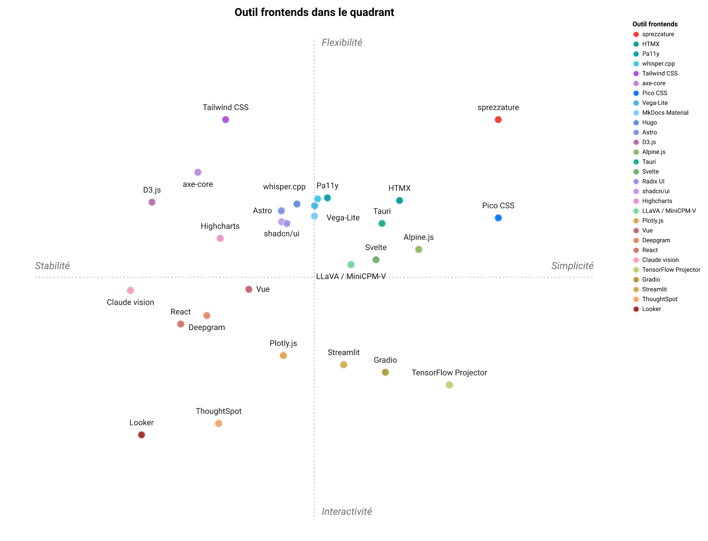

# Paysage : alternatives à `sprezzature`

`sprezzature` est **une** réponse assumée à une vaste question : *comment un grand modèle de langage (LLM) devrait-il produire du code frontend ?* Ce fichier cartographie les alternatives dans chacune des catégories touchées par les *skills* `sprezzature-*`, sous forme de **matrices** : les lignes sont des outils, les colonnes des caractéristiques qui comptent vraiment. Servez-vous-en pour choisir en connaissance de cause.

## Frameworks agentiques : où se situe sprezzature

Le monorepo `sprezzature` est en partie un framework agentique : il définit des *skills* que Claude / OpenCode exécutent. Voici comment il se compare aux frameworks agentiques généralistes :

| Framework | Multimodal | Local d'abord | Outils pip | *Skill*-natif | Publication web | A11y / figures intégrés |
|---|:---:|:---:|:---:|:---:|:---:|:---:|
| **sprezzature** | ✓ | ✓ | ✓ | ✓ | ✓ | ✓ |
| [LangChain](https://python.langchain.com) | ~ | ~ | ✓ | ✗ | ✗ | ✗ |
| [LlamaIndex](https://www.llamaindex.ai) | ~ | ~ | ✓ | ✗ | ✗ | ✗ |
| [Haystack](https://haystack.deepset.ai) | ✗ | ~ | ✓ | ✗ | ✗ | ✗ |
| [AutoGen](https://microsoft.github.io/autogen/) | ~ | ~ | ✓ | ✗ | ✗ | ✗ |
| [CrewAI](https://www.crewai.com) | ✗ | ✗ | ✓ | ✗ | ✗ | ✗ |

Différences clés :

- LangChain / LlamaIndex sont des frameworks de chaînes et de récupération généralistes. Ils ne livrent pas de *skills* de domaine intégrés pour l'accessibilité, les graphiques ou la publication.
- Haystack se concentre sur les pipelines de traitement du langage naturel (NLP). Pas de sortie multimodale, pas d'outillage frontend.
- AutoGen / CrewAI gèrent bien l'orchestration multi-agents, mais les agents doivent être écrits de zéro. Pas d'audit de graphiques, pas de lint a11y, pas de simulation de daltonisme.
- `sprezzature` est délibérément étroit : neuf *skills*, une seule pile frontend (JS pur + Tailwind), exécution locale via `sprezzature-local`. Choisissez LangChain quand votre problème est la récupération à grande échelle ; choisissez `sprezzature` quand le problème est la qualité frontend au niveau du document humain.

`sprezzature-local` (le runtime de la couche 3) propose LangChain comme backend optionnel (`SPREZZATURE_LLM_BACKEND=langchain`), ce qui rend les deux complémentaires.

## Note sur le biais

Ce fichier est écrit par l'auteur de `sprezzature`. La colonne « Compatible sprezzature » n'est **pas un score de qualité** : elle signale si chaque alternative s'insère dans la sortie émise par `sprezzature` (vanilla JS, Tailwind, sans environnement d'exécution de framework). La plupart des alternatives marquées ✗ sont excellentes dans ce qu'elles font ; le repère signifie seulement « choix de conception différent, pas un compagnon prêt à l'emploi ». Lisez la colonne Notes et le paragraphe « Choisir X quand… » après chaque table pour la phrase honnête. Si vous êtes venu chercher « est-ce que `sprezzature` est meilleur ? », la réponse est **presque jamais dans l'absolu, meilleur seulement pour quelques formes de projet bien précises**, nommées ci-dessous.

## Où `sprezzature` est réellement le meilleur choix

Trois catégories concrètes où les *skills* `sprezzature-*`, ensemble, font quelque chose qu'aucun autre outil listé ne fait sous forme de *skill* :

1. **Maquettes d'interface en ligne de commande (CLI) → interface graphique (GUI) depuis `tool --help`.** `sprezzature-cli-gui` échafaude une GUI vanilla-JS + Tailwind depuis le parseur d'arguments d'un CLI Python / Node / Go, en *skill*, sans environnement d'exécution de framework. Aucun autre outil listé ne fait cela comme *skill* Claude / OpenCode : Gradio / Streamlit / Gooey produisent une interface utilisateur (UI) à l'exécution difficile à restyler et ne sont pas des *skills*.
2. **Barrières d'accessibilité (a11y) avant expédition, en intégration continue (CI), sans navigateur sans interface graphique.** `sprezzature-accessibility/scripts/lint_a11y.py` est un lint Python d'un seul fichier, stdlib uniquement, qui tourne en millisecondes dans n'importe quel conteneur CI minimal. axe-core / Pa11y / Lighthouse sont la bonne réponse pour les audits à l'exécution (et vous devriez faire les deux), mais aucun ne tourne sans navigateur et c'est un coût réel dans un hook de pré-commit.
3. **Sites de documentation bilingues EN/FR (ou EN/DE, EN/ES, EN/JA)** où la parité typographique et de ton compte. `sprezzature-publish` + la réécriture en langage clair de `sprezzature-ui` + `i18n.md` s'articulent ensemble. Aucun générateur de site statique (SSG) seul ne livre cette combinaison.

## Où choisir autre chose

Les choix par défaut, en toute honnêteté, quand un autre outil l'emporte nettement :

- **Workflow bibliothèque de composants React / Vue / Svelte** → **[shadcn/ui](https://ui.shadcn.com)**. Même philosophie copier-coller que `sprezzature`, mais native au framework, avec un public bien plus large et bien plus de composants. `sprezzature` refuse délibérément d'émettre du code de framework ; si votre équipe a choisi React, aller contre `sprezzature` est une erreur.
- **Vrai zéro-build pour les sites orientés contenu** → **[HTMX](https://htmx.org) + un framework CSS (feuilles de style en cascade) sans classes (ex. [Pico CSS](https://picocss.com), [Simple.css](https://simplecss.org))**. HTMX n'a pas besoin de build, le CSS sans classes non plus et le HTML (langage de balisage des pages web) résultant est le livrable le plus léger que l'on puisse raisonnablement viser. `sprezzature` ne revendique le « zéro build » que sur le chemin prototype (réseau de diffusion de contenu / CDN Tailwind Play) ; HTMX + Pico est zéro build aussi en production.
- **Gros sites de documentation versionnés (100+ pages, vues par version)** → **[MkDocs Material](https://squidfunk.github.io/mkdocs-material/), [Hugo](https://gohugo.io), [Astro](https://astro.build) ou [Docusaurus](https://docusaurus.io)**. `sprezzature-publish` est dimensionné pour ≤ 30 pages.
- **Alt-text hébergé de très haute qualité** → **Claude vision, GPT-4o vision, Gemini Vision**. `sprezzature-vision/scripts/alt_from_ollama.py` est le bon choix quand localité / coût / confidentialité comptent ; les modèles hébergés sont nettement meilleurs sur la longue traîne.
- **Sous-titres en direct, latence sous le temps réel** → **Deepgram, AssemblyAI**.

La plupart des autres catégories : il existe un meilleur outil si vous vous spécialisez. Les matrices ci-dessous le nomment explicitement.

## Légende

- **✓** oui / natif
- **~** partiel / nécessite de la configuration
- **✗** non
- **N/A** ne s'applique pas à la catégorie de cette ligne

Les coûts sont sous licence permissive MIT/Apache sauf mention contraire. La colonne Stack (base technique) liste le langage contre lequel un développeur de l'outil écrit, pas le moteur sous-jacent.

## Positionnement concurrentiel : une table

Lignes = projets, colonnes = critères, chaque cellule notée **1–5 ⭐️** (partout, plus c'est
mieux). Les notes sont celles de l'auteur, volontairement honnêtes : `sprezzature` échange la
**maturité** d'écosystème contre la légèreté, la restylabilité, l'accessibilité et une
livraison **en *skill***.

| Projet | Local-first | Léger | Personnalisable | Accessibilité | Maturité | Intégré | Interactif | Libre | Facilité | Écosystème |
|---|:---:|:---:|:---:|:---:|:---:|:---:|:---:|:---:|:---:|:---:|
| **sprezzature** (les *skills*) | ⭐️⭐️⭐️⭐️⭐️ | ⭐️⭐️⭐️⭐️⭐️ | ⭐️⭐️⭐️⭐️⭐️ | ⭐️⭐️⭐️⭐️⭐️ | ⭐️⭐️ | ⭐️⭐️⭐️⭐️⭐️ | ⭐️⭐️⭐️⭐️ | ⭐️⭐️⭐️⭐️⭐️ | ⭐️⭐️⭐️⭐️ | ⭐️⭐️ |
| [React](https://react.dev) | ⭐️⭐️⭐️⭐️⭐️ | ⭐️ | ⭐️⭐️⭐️ | ⭐️⭐️ | ⭐️⭐️⭐️⭐️⭐️ | ⭐️ | ⭐️⭐️⭐️⭐️ | ⭐️⭐️⭐️⭐️⭐️ | ⭐️⭐️ | ⭐️⭐️⭐️⭐️⭐️ |
| [Vue](https://vuejs.org) | ⭐️⭐️⭐️⭐️⭐️ | ⭐️⭐️ | ⭐️⭐️⭐️ | ⭐️⭐️⭐️ | ⭐️⭐️⭐️⭐️⭐️ | ⭐️ | ⭐️⭐️⭐️⭐️ | ⭐️⭐️⭐️⭐️⭐️ | ⭐️⭐️⭐️ | ⭐️⭐️⭐️⭐️ |
| [Svelte](https://svelte.dev) | ⭐️⭐️⭐️⭐️⭐️ | ⭐️⭐️⭐️⭐️ | ⭐️⭐️⭐️ | ⭐️⭐️⭐️ | ⭐️⭐️⭐️⭐️ | ⭐️ | ⭐️⭐️⭐️⭐️ | ⭐️⭐️⭐️⭐️⭐️ | ⭐️⭐️⭐️⭐️ | ⭐️⭐️⭐️ |
| [HTMX](https://htmx.org) | ⭐️⭐️⭐️⭐️⭐️ | ⭐️⭐️⭐️⭐️ | ⭐️⭐️⭐️⭐️ | ⭐️⭐️⭐️⭐️ | ⭐️⭐️⭐️ | ⭐️ | ⭐️⭐️⭐️ | ⭐️⭐️⭐️⭐️⭐️ | ⭐️⭐️⭐️⭐️ | ⭐️⭐️⭐️ |
| [Alpine.js](https://alpinejs.dev) | ⭐️⭐️⭐️⭐️⭐️ | ⭐️⭐️⭐️⭐️ | ⭐️⭐️⭐️ | ⭐️⭐️⭐️ | ⭐️⭐️⭐️ | ⭐️ | ⭐️⭐️⭐️ | ⭐️⭐️⭐️⭐️⭐️ | ⭐️⭐️⭐️⭐️ | ⭐️⭐️⭐️ |
| [Tailwind CSS](https://tailwindcss.com) | ⭐️⭐️⭐️⭐️⭐️ | ⭐️⭐️⭐️⭐️ | ⭐️⭐️⭐️⭐️⭐️ | ⭐️⭐️⭐️⭐️ | ⭐️⭐️⭐️⭐️⭐️ | ⭐️⭐️ | ⭐️ | ⭐️⭐️⭐️⭐️⭐️ | ⭐️⭐️⭐️⭐️ | ⭐️⭐️⭐️⭐️⭐️ |
| [Pico CSS](https://picocss.com) | ⭐️⭐️⭐️⭐️⭐️ | ⭐️⭐️⭐️⭐️⭐️ | ⭐️⭐️ | ⭐️⭐️⭐️⭐️ | ⭐️⭐️⭐️ | ⭐️ | ⭐️ | ⭐️⭐️⭐️⭐️⭐️ | ⭐️⭐️⭐️⭐️⭐️ | ⭐️⭐️ |
| [shadcn/ui](https://ui.shadcn.com) | ⭐️⭐️⭐️⭐️⭐️ | ⭐️⭐️⭐️ | ⭐️⭐️⭐️⭐️ | ⭐️⭐️⭐️⭐️ | ⭐️⭐️⭐️⭐️ | ⭐️ | ⭐️⭐️⭐️⭐️ | ⭐️⭐️⭐️⭐️⭐️ | ⭐️⭐️⭐️ | ⭐️⭐️⭐️⭐️ |
| [Radix UI](https://www.radix-ui.com) | ⭐️⭐️⭐️⭐️⭐️ | ⭐️⭐️⭐️ | ⭐️⭐️⭐️ | ⭐️⭐️⭐️⭐️⭐️ | ⭐️⭐️⭐️⭐️ | ⭐️ | ⭐️⭐️⭐️⭐️ | ⭐️⭐️⭐️⭐️⭐️ | ⭐️⭐️⭐️ | ⭐️⭐️⭐️⭐️ |
| [Vega-Lite](https://vega.github.io/vega-lite/) | ⭐️⭐️⭐️⭐️⭐️ | ⭐️⭐️⭐️ | ⭐️⭐️⭐️⭐️ | ⭐️⭐️⭐️⭐️ | ⭐️⭐️⭐️⭐️ | ⭐️⭐️ | ⭐️⭐️⭐️⭐️ | ⭐️⭐️⭐️⭐️⭐️ | ⭐️⭐️⭐️⭐️ | ⭐️⭐️⭐️⭐️ |
| [D3.js](https://d3js.org) | ⭐️⭐️⭐️⭐️⭐️ | ⭐️⭐️⭐️⭐️ | ⭐️⭐️⭐️⭐️⭐️ | ⭐️⭐️⭐️ | ⭐️⭐️⭐️⭐️⭐️ | ⭐️ | ⭐️⭐️⭐️⭐️⭐️ | ⭐️⭐️⭐️⭐️⭐️ | ⭐️ | ⭐️⭐️⭐️⭐️⭐️ |
| [Plotly.js](https://plotly.com/javascript/) | ⭐️⭐️⭐️⭐️⭐️ | ⭐️ | ⭐️⭐️ | ⭐️⭐️⭐️ | ⭐️⭐️⭐️⭐️ | ⭐️ | ⭐️⭐️⭐️⭐️⭐️ | ⭐️⭐️⭐️⭐️ | ⭐️⭐️⭐️ | ⭐️⭐️⭐️⭐️ |
| [Gradio](https://gradio.app) | ⭐️⭐️⭐️⭐️ | ⭐️⭐️ | ⭐️ | ⭐️⭐️⭐️ | ⭐️⭐️⭐️⭐️ | ⭐️ | ⭐️⭐️⭐️⭐️ | ⭐️⭐️⭐️⭐️ | ⭐️⭐️⭐️⭐️⭐️ | ⭐️⭐️⭐️ |
| [Streamlit](https://streamlit.io) | ⭐️⭐️⭐️⭐️ | ⭐️⭐️ | ⭐️ | ⭐️⭐️⭐️ | ⭐️⭐️⭐️⭐️ | ⭐️ | ⭐️⭐️⭐️⭐️ | ⭐️⭐️⭐️⭐️ | ⭐️⭐️⭐️⭐️⭐️ | ⭐️⭐️⭐️⭐️ |
| [Tauri](https://tauri.app) | ⭐️⭐️⭐️⭐️⭐️ | ⭐️⭐️⭐️⭐️ | ⭐️⭐️⭐️⭐️ | ⭐️⭐️⭐️ | ⭐️⭐️⭐️ | ⭐️ | ⭐️⭐️⭐️ | ⭐️⭐️⭐️⭐️⭐️ | ⭐️⭐️⭐️ | ⭐️⭐️⭐️ |
| [Hugo](https://gohugo.io) | ⭐️⭐️⭐️⭐️⭐️ | ⭐️⭐️⭐️⭐️ | ⭐️⭐️⭐️⭐️ | ⭐️⭐️⭐️ | ⭐️⭐️⭐️⭐️ | ⭐️ | ⭐️⭐️ | ⭐️⭐️⭐️⭐️⭐️ | ⭐️⭐️⭐️ | ⭐️⭐️⭐️⭐️ |
| [Astro](https://astro.build) | ⭐️⭐️⭐️⭐️⭐️ | ⭐️⭐️⭐️ | ⭐️⭐️⭐️⭐️ | ⭐️⭐️⭐️⭐️ | ⭐️⭐️⭐️⭐️ | ⭐️ | ⭐️⭐️⭐️ | ⭐️⭐️⭐️⭐️⭐️ | ⭐️⭐️⭐️ | ⭐️⭐️⭐️⭐️ |
| [MkDocs Material](https://squidfunk.github.io/mkdocs-material/) | ⭐️⭐️⭐️⭐️⭐️ | ⭐️⭐️⭐️⭐️ | ⭐️⭐️⭐️ | ⭐️⭐️⭐️⭐️ | ⭐️⭐️⭐️⭐️ | ⭐️ | ⭐️⭐️ | ⭐️⭐️⭐️⭐️ | ⭐️⭐️⭐️⭐️ | ⭐️⭐️⭐️⭐️ |
| [axe-core](https://github.com/dequelabs/axe-core) | ⭐️⭐️⭐️⭐️⭐️ | ⭐️⭐️⭐️⭐️ | ⭐️⭐️⭐️ | ⭐️⭐️⭐️⭐️⭐️ | ⭐️⭐️⭐️⭐️⭐️ | ⭐️ | ⭐️ | ⭐️⭐️⭐️⭐️ | ⭐️⭐️⭐️ | ⭐️⭐️⭐️⭐️⭐️ |
| [Pa11y](https://pa11y.org) | ⭐️⭐️⭐️⭐️⭐️ | ⭐️⭐️⭐️ | ⭐️⭐️⭐️ | ⭐️⭐️⭐️⭐️⭐️ | ⭐️⭐️⭐️⭐️ | ⭐️ | ⭐️ | ⭐️⭐️⭐️⭐️⭐️ | ⭐️⭐️⭐️ | ⭐️⭐️⭐️ |
| [Claude vision](https://docs.claude.com/en/docs/build-with-claude/vision) | ⭐️ | ⭐️⭐️⭐️ | ⭐️⭐️⭐️ | ⭐️⭐️⭐️⭐️ | ⭐️⭐️⭐️⭐️⭐️ | ⭐️⭐️ | ⭐️⭐️ | ⭐️ | ⭐️⭐️⭐️ | ⭐️⭐️⭐️⭐️⭐️ |
| [LLaVA / MiniCPM-V](https://huggingface.co/docs/transformers/model_doc/llava) | ⭐️⭐️⭐️⭐️⭐️ | ⭐️⭐️ | ⭐️⭐️⭐️ | ⭐️⭐️⭐️ | ⭐️⭐️⭐️ | ⭐️ | ⭐️ | ⭐️⭐️⭐️⭐️⭐️ | ⭐️⭐️ | ⭐️⭐️⭐️ |
| [whisper.cpp](https://github.com/ggml-org/whisper.cpp) | ⭐️⭐️⭐️⭐️⭐️ | ⭐️⭐️⭐️⭐️⭐️ | ⭐️⭐️⭐️ | ⭐️⭐️⭐️ | ⭐️⭐️⭐️⭐️ | ⭐️ | ⭐️ | ⭐️⭐️⭐️⭐️⭐️ | ⭐️⭐️⭐️ | ⭐️⭐️⭐️⭐️ |
| [Deepgram](https://deepgram.com) | ⭐️ | ⭐️⭐️⭐️ | ⭐️⭐️⭐️ | ⭐️⭐️⭐️⭐️ | ⭐️⭐️⭐️⭐️ | ⭐️ | ⭐️⭐️ | ⭐️ | ⭐️⭐️⭐️ | ⭐️⭐️⭐️⭐️ |
| [Looker](https://cloud.google.com/looker) | ⭐️ | ⭐️ | ⭐️⭐️ | ⭐️⭐️⭐️ | ⭐️⭐️⭐️⭐️⭐️ | ⭐️ | ⭐️⭐️⭐️⭐️⭐️ | ⭐️ | ⭐️⭐️ | ⭐️⭐️⭐️⭐️ |
| [ThoughtSpot](https://www.thoughtspot.com) | ⭐️⭐️ | ⭐️ | ⭐️⭐️ | ⭐️⭐️⭐️ | ⭐️⭐️⭐️⭐️ | ⭐️ | ⭐️⭐️⭐️⭐️⭐️ | ⭐️ | ⭐️⭐️⭐️ | ⭐️⭐️⭐️⭐️ |
| [Highcharts](https://www.highcharts.com) | ⭐️⭐️⭐️⭐️⭐️ | ⭐️⭐️⭐️ | ⭐️⭐️⭐️⭐️ | ⭐️⭐️⭐️⭐️⭐️ | ⭐️⭐️⭐️⭐️⭐️ | ⭐️ | ⭐️⭐️⭐️⭐️⭐️ | ⭐️⭐️ | ⭐️⭐️⭐️⭐️ | ⭐️⭐️⭐️⭐️ |
| [TensorFlow Embedding Projector](https://projector.tensorflow.org) | ⭐️⭐️⭐️⭐️ | ⭐️⭐️⭐️ | ⭐️ | ⭐️⭐️ | ⭐️⭐️⭐️ | ⭐️ | ⭐️⭐️⭐️⭐️⭐️ | ⭐️⭐️⭐️⭐️⭐️ | ⭐️⭐️⭐️ | ⭐️⭐️ |

**Sur la localité :** `sprezzature` fonctionne **local d'abord (local-first)**, comme la plupart des
outils qui tournent sur votre machine, mais ce n'est plus vrai de tous les acteurs cités ici : les plateformes de *business intelligence* (BI)
hébergées (Looker, ThoughtSpot) et les intelligences artificielles (IA) en ligne (Claude vision, Deepgram)
ne le sont pas. Avec ces nouveaux venus, la colonne **discrimine désormais** et entre pleinement dans la carte.

Passés en entiers à [standpoint](https://github.com/warith-harchaoui/standingpoint) (avec `sprezzature`
en ligne de référence), les dix critères se projettent sur une **carte de positionnement** 2-D :

L'axe horizontal oppose **Stabilité** (à gauche : maturité et écosystème installés) et **Simplicité**
(à droite : prise en main immédiate) ; l'axe vertical oppose **Flexibilité** (en haut : restylable et
léger) et **Interactivité** (en bas : exploration interactive pour l'utilisateur final) : ensemble ~55 %
de ce qui distingue ces approches. `sprezzature` ancre le coin haut-droite ; **Looker** est à l'opposé
exact (plateforme BI hébergée, lourde et propriétaire) ; **Tailwind CSS** va le plus loin vers
« Flexibilité » et **Pico CSS** le plus loin vers « Simplicité ». Les notes vivent dans un fichier de
valeurs séparées par des virgules (CSV) **exclu du dépôt Git** (`.private/landscape/landscape-fr.csv`) ;
on régénère la carte avec `standpoint .private/landscape/landscape-fr.csv -r sprezzature -o out --model qwen3-vl:8b`.

Les matrices par catégorie ci-dessous conservent les colonnes qui n'ont de sens qu'au sein d'une seule catégorie.

---

## Choix rapide

Quel genre de travail faites-vous ? Trouvez la ligne et la recommandation honnête.

| Vous voulez… | *Skill* `sprezzature` | Quand choisir autre chose |
|---|---|---|
| Sortie UI vanilla JS + Tailwind, sans framework | `sprezzature-ui` | Si l'équipe a déjà choisi React/Vue/Svelte. `sprezzature` refuse d'émettre du code de framework ; vous lutteriez contre lui. |
| Base technique React + design system | aucun | [shadcn/ui](https://ui.shadcn.com), [Mantine](https://mantine.dev), [Material UI (MUI)](https://mui.com). shadcn est le plus proche en philosophie (copier-coller, sans verrou d'exécution). |
| Look natif Material 3 | aucun | [Material Web Components](https://material-web.dev) pour du Material officiel ; `sprezzature-ui/references/material-design.md` ne fait que projeter les rôles Material dans les variables de design du *skill*. |
| Envelopper un CLI Python / Node / Go dans une GUI web | `sprezzature-cli-gui` | Si vous voulez un formulaire auto-généré depuis la signature sans contrôle de l'UI : [Gradio](https://gradio.app) (démos d'apprentissage automatique / ML), [Streamlit](https://streamlit.io) (apps de données), [Taipy](https://taipy.io). `sprezzature-cli-gui` échafaude du HTML brut que vous éditez ; ces outils donnent une UI à l'exécution difficile à restyler. |
| Envelopper un CLI en binaire d'application desktop native | `sprezzature-cli-gui` (UI) + Tauri (coquille) | [Tauri](https://tauri.app) est la coquille desktop ; `sprezzature-cli-gui` émet ce qui va dans la vue web. Si vous n'avez besoin que du desktop, les choix par défaut de Tauri suffisent. |
| Construire un site de doc depuis un petit README + `docs/` | `sprezzature-publish` | Pour 100+ pages versionnées ou un site de doc avec vues par version côte à côte : [MkDocs Material](https://squidfunk.github.io/mkdocs-material/), [Hugo](https://gohugo.io), [Astro](https://astro.build), [Docusaurus](https://docusaurus.io). `sprezzature-publish` est pour les petits projets (< 30 pages). |
| Graphiques déclaratifs en notation d'objets JavaScript (JSON) avec un style maison | `sprezzature-ui` | Pour des graphiques sur mesure / 3D / scientifiques : [D3](https://d3js.org), [Plotly](https://plotly.com), [Three.js](https://threejs.org). `sprezzature-ui` livre des specs Vega-Lite v5. |
| Lint a11y en CI sans navigateur | `sprezzature-accessibility` | C'est une barrière de pré-commit. Pour les audits du modèle objet du document (DOM) à l'exécution (après JS, attributs d'accessibilité Accessible Rich Internet Applications (ARIA) dynamiques, ordre de focus après traitement asynchrone) : [axe-core](https://github.com/dequelabs/axe-core), [Pa11y](https://pa11y.org), Lighthouse. Faites les deux. |
| Rédaction de texte alternatif en local uniquement | `sprezzature-accessibility` | Pour du texte alternatif hébergé de très haute qualité : [Claude vision](https://docs.claude.com/en/docs/build-with-claude/vision), [GPT-4o vision](https://platform.openai.com/docs/guides/vision), [Gemini Vision](https://ai.google.dev/gemini-api/docs/vision). L'hébergé est plus précis ; le local est gratuit et privé. |
| Sous-titres locaux, adaptés au processeur (CPU) | `sprezzature-accessibility` | Pour des sous-titres en direct temps réel : [Deepgram](https://deepgram.com), [AssemblyAI](https://www.assemblyai.com). `sprezzature-accessibility` utilise whisper.cpp : rapide sur CPU, pas en direct. |
| Appliquer / auditer les lois canoniques de l'expérience utilisateur (UX) (Hick, Fitts, Miller, Jakob, Tesler, Peak-End, …) sur le HTML émis | `sprezzature-ux-laws` | Pour la théorie au long cours et une typologie plus riche, lisez [Yablonski, *Laws of UX*, 2e éd.](https://lawsofux.com/book/) et le site [lawsofux.com](https://lawsofux.com/) lui-même ; le *skill* reformule l'ensemble sélectionné et livre un auditeur stdlib uniquement ; il ne remplace ni le matériau source ni les tests d'utilisabilité comportementaux. |
| Page d'atterrissage marketing | aucun | Webflow, Framer ou une agence de design. `sprezzature` impose une base technique optimisée pour la clarté, pas pour la différenciation de marque. |
| Identité visuelle sur mesure pour une app grand public | aucun | Engagez un designer. `sprezzature` utilise volontairement une seule famille de palette et deux polices. |

---

## 1. Framework JavaScript / sans framework

`sprezzature` refuse d'émettre du code de framework. Les alternatives, si un framework s'impose :

> Abréviations : SSR = rendu côté serveur, KB = kilooctets.

| Alternative | Taille runtime (min+gz) | Build | Modèle de composant | SSR | Réputation a11y | Compatible sprezzature | Notes |
|---|---|:---:|---|:---:|---|:---:|---|
| **`sprezzature` (vanilla JS + Tailwind)** | 0 KB framework + Tailwind CSS | optionnel | éléments natifs + `customElements` | N/A | forte par défaut | ✓ | Ce que ce *skill* émet. |
| [React](https://react.dev) | ~45 KB | ✓ | composants JSX (syntaxe JavaScript étendue de React) | ✓ (Next, Remix) | nécessite Radix / Headless UI | ✗ | Plus grand écosystème, plus grosse charge utile. |
| [Vue](https://vuejs.org) | ~34 KB | ✓ | composant en fichier unique (SFC) `<template>` | ✓ (Nuxt) | bonne | ✗ | Plus proche du HTML que JSX. |
| [Svelte / SvelteKit](https://svelte.dev) | ~10 KB | ✓ | SFC `.svelte` | ✓ | bonne | ✗ | Plus petit runtime des trois grands. |
| [Solid](https://www.solidjs.com) | ~7 KB | ✓ | JSX, réactivité fine | ✓ | correcte | ✗ | Modèle mental React, charge plus légère. |
| [Qwik](https://qwik.dev) | « 0 KB » (resumable) | ✓ | composants JSX | ✓ | correcte | ✗ | Meilleur temps jusqu'à l'interactivité (TTI) au démarrage à froid. |
| [Preact](https://preactjs.com) | ~4 KB | ✓ | composants JSX | ✓ | correcte | ✗ | Interface de programmation (API) React, plus légère. |
| [Lit](https://lit.dev) | ~6 KB | optionnel | Web Components | ✓ | bonne | ~ | `sprezzature` *émettra* `customElements.define` quand c'est justifié. |
| [HTMX](https://htmx.org) | ~14 KB | ✗ | échanges HTML pilotés serveur | ✓ | bonne | ~ | Se marie bien avec `sprezzature` : HTMX pour la navigation, `sprezzature` pour les détails client. |
| [Alpine.js](https://alpinejs.dev) | ~7 KB | ✗ | touches pilotées par attributs | N/A | correcte | ~ | « jQuery des années 2020 ». Même esprit, attribut-first plutôt que module-first. |

**Choisir `sprezzature`** pour les projets neufs où le livrable est du HTML que l'équipe possédera pendant des années et où personne ne veut suivre les versions d'un framework. **Choisir un framework** (React d'abord pour l'employabilité, Svelte / Solid / Qwik pour la charge utile) quand l'app a un vrai modèle de composant : état client large, routage client complexe ou un design system dont le reste de l'entreprise dépend déjà. **HTMX ou Lit** sont les voisins naturels de `sprezzature` : HTMX pour la navigation pilotée serveur, Lit quand un morceau d'UI est réellement un web component réutilisable.

---

## 2. Approche CSS

| Alternative | Sortie | Build | Style de classe | Design tokens | UX mode sombre | Compatible sprezzature | Notes |
|---|---|:---:|---|---|---|:---:|---|
| **Tailwind CSS** (utilisé) | utilitaires atomiques | ✓ | `bg-brand-blue text-label-primary` | sémantiques via config | pair `dark:` de première classe | ✓ | Ce que `sprezzature` utilise. |
| [UnoCSS](https://unocss.dev) | utilitaires atomiques | ✓ | compatible Tailwind + presets | sémantiques | de première classe | ~ | Remplacement direct plus rapide. |
| [Bootstrap](https://getbootstrap.com) | classes de composant | ~ | `btn btn-primary` | couleur nommée | classes de mode | ✗ | Démarrage rapide ; look uniforme. |
| [Bulma](https://bulma.io) | classes de composant | ✗ | `button is-primary` | couleur nommée | CSS à basculer | ✗ | Comme Bootstrap, surface plus petite. |
| [Pico CSS](https://picocss.com) | sans classes sur balises sémantiques | ✗ | aucune | aucun | auto | ✗ | Excellent pour la prose, faible pour les apps. |
| [Open Props](https://open-props.style) | variables CSS (design tokens seuls) | ✗ | méthodologie à apporter | variables de design nommées | à basculer | ~ | Se marie avec du CSS brut. |
| [vanilla CSS + BEM](https://getbem.com) | écrit avec soin | ✗ | `.block__elem--mod` | manuel | manuel | ✗ | Convention de nommage Block-Element-Modifier (BEM). Le plus pérenne ; le plus lent à écrire. |
| [CSS Modules](https://github.com/css-modules/css-modules) | CSS scopé | ✓ | suffixé par empreinte | manuel | manuel | ✗ | Standard dans beaucoup de monorepos React. |
| [Panda CSS](https://panda-css.com) | CSS-in-JS sans exécution | ✓ | recettes / patrons | variables de design typées | de première classe | ✗ | Fort dans les apps TypeScript (TS). |
| [vanilla-extract](https://vanilla-extract.style) | CSS-in-JS sans exécution | ✓ | feuilles de style typées | variables de design typées | de première classe | ✗ | Ami du TS uniquement. |

**Choisir Tailwind** quand l'équipe peut lancer un build CLI d'une ligne (ou fait déjà tourner Vite). **Choisir Pico** quand le site est surtout de la prose et que vous voulez zéro classe dans le markup. **Choisir Panda / vanilla-extract** quand vous êtes dans un monorepo TypeScript avec des variables de design typées ailleurs. **Éviter le BEM bricolé** en 2026 sauf si le reste du code y vit déjà.

---

## 3. Bibliothèque de composants / design system

| Alternative | Stack | Distribution | Réputation a11y | Identité visuelle | Coût | Compatible sprezzature | Notes |
|---|---|---|---|---|---|:---:|---|
| **`sprezzature/assets/components/`** (utilisé) | HTML + Tailwind | fichiers copier-coller | forte | variables de design de ce *skill* | gratuit | ✓ | Vit dans le markup, sans dépendance. |
| [shadcn/ui](https://ui.shadcn.com) | React + Tailwind + Radix | CLI copier-coller | forte (via Radix) | neutre, thématisable | gratuit | ~ | Philosophie la plus proche ; React seulement. |
| [Headless UI](https://headlessui.com) | React / Vue | npm | forte | à apporter | gratuit | ✗ | Comportement seul. |
| [Radix UI](https://www.radix-ui.com) | React | npm | meilleure de sa catégorie | neutre | gratuit | ✗ | Primitives, pas de visuel. |
| [Ark UI](https://ark-ui.com) | React / Vue / Solid | npm | forte | aucune | gratuit | ✗ | Type Radix, agnostique au framework. |
| [DaisyUI](https://daisyui.com) | plugin Tailwind | npm | correcte | thèmes nommés | gratuit | ✗ | Classes de composant par-dessus Tailwind. |
| [Flowbite](https://flowbite.com) | Tailwind + JS | npm | correcte | nommée | freemium | ✗ | Widgets pré-construits. |
| [MUI](https://mui.com) | React | npm | forte | Material 3 | gratuit / pro payant | ✗ | Plus grand design system React. |
| [Mantine](https://mantine.dev) | React | npm | forte | neutre | gratuit | ✗ | Grande surface, choix par défaut judicieux. |
| [Chakra UI](https://chakra-ui.com) | React | npm | forte | neutre | gratuit | ✗ | Même catégorie que Mantine. |
| [Carbon](https://carbondesignsystem.com) | React / web components | npm | forte | IBM | gratuit | ✗ | Dans l'écosystème IBM. |
| [Fluent UI](https://react.fluentui.dev) | React | npm | forte | Microsoft | gratuit | ✗ | Dans l'écosystème Microsoft. |
| [Primer](https://primer.style) | React / CSS / Rails | npm/gem | forte | GitHub | gratuit | ✗ | Dans GitHub. |
| [Polaris](https://polaris.shopify.com) | React | npm | forte | Shopify | gratuit | ✗ | Dans Shopify. |
| [Lightning](https://www.lightningdesignsystem.com) | Lightning Web Components (LWC) / React | npm | forte | Salesforce | gratuit | ✗ | Dans Salesforce. |
| [Shoelace / Web Awesome](https://shoelace.style) | Web Components | npm | forte | neutre | gratuit | ~ | Agnostique au framework ; le plus proche si vous voulez `<sl-button>` plutôt que du bricolage. |

**Choisir shadcn/ui** si l'équipe a choisi React et veut la même philosophie que `sprezzature` (composants copier-coller, sans verrou d'exécution). **Choisir Radix / Headless UI** quand vous voulez seulement le comportement et habillerez tout vous-même. **Choisir Mantine / Chakra / MUI** quand la vitesse jusqu'au premier écran compte plus que la différenciation visuelle. **Rester dans les design systems des grandes boîtes** (Carbon, Fluent, Primer, Polaris, Lightning) seulement si vous livrez à l'intérieur de la surface produit de cette entreprise.

---

## 4. Typographie (police d'UI)

`sprezzature-ui` prend par défaut la **règle des trois Roboto** quand il génère
une UI neuve et que l'utilisateur n'a pas spécifié de police : trois
polices web téléchargées, toutes de la super-famille Roboto. Le trio partage
métriques, hauteur d'x et rythme visuel par conception, ce qui garde
cohérentes les surfaces riches en prose et riches en code et réduit la
charge à ~290 KB au total (sous-ensemble latin, les trois combinées,
format de police web Web Open Font Format version 2 (WOFF2) à axe variable). **La règle est une valeur par défaut, pas une
contrainte** : selon la règle stricte 3 de `sprezzature-ui/SKILL.md` (depuis v0.6.4), le *skill*
respecte les polices existantes lors de l'audit d'une UI existante et
honore toute police nommée par l'utilisateur.

| Police | Graisses | Latin étendu / cyrillique | Licence | Variable | Coût | Compatible sprezzature | Notes |
|---|---|---|---|:---:|---|:---:|---|
| **Roboto** (utilisée, sans)     | 100–900 + italiques | les deux | SIL Open Font License (OFL) | ✓ | gratuit | ✓ | Auto-hébergée dans `sprezzature-ui/assets/fonts/roboto/`. UI + corps par défaut. |
| **Roboto Serif** (utilisée, serif) | 100–900 + italiques | les deux | OFL | ✓ | gratuit | ✓ | Auto-hébergée dans `sprezzature-ui/assets/fonts/roboto-serif/`. Éditorial / textes longs. |
| **Roboto Mono** (utilisée, mono)   | 100–700 + italiques | les deux | OFL | ✓ | gratuit | ✓ | Auto-hébergée dans `sprezzature-ui/assets/fonts/roboto-mono/`. `<code>` / `<pre>` / panneaux de logs. |
| [Inter](https://rsms.me/inter/) | 100–900 + italiques | les deux | OFL | ✓ | gratuit | ~ | Choix par défaut de l'industrie pour l'UI SaaS. Pas celui du *skill*, mais honorée si l'utilisateur la nomme. |
| [Montserrat](https://fonts.google.com/specimen/Montserrat) | 100–900 + italiques | les deux | OFL | ✓ | gratuit | ~ | Ancien choix par défaut, remplacé par Roboto en v0.6.0. Toujours honoré si un projet la nomme. |
| [IBM Plex Sans](https://www.ibm.com/plex/) | 100–700 | les deux | OFL | ~ | gratuit | ~ | Corporate neutre. Pas le choix par défaut ; le *skill* la porte si un projet la livre. |
| [Roboto Flex](https://fonts.google.com/specimen/Roboto+Flex) | variable | les deux | Apache | ✓ | gratuit | ~ | Choix par défaut de Material, sœur du Roboto classique embarqué. |
| Pile System UI | dépend du système d'exploitation (OS) | dépend de l'OS | aucune | dépend | gratuit | ~ | Zéro octet, pas de marque, utilisée en repli dans les trois piles Roboto. |
| [Geist](https://vercel.com/font) | 100–900 | latin | OFL | ✓ | gratuit | ✗ | Sans géométrique plus récent (Vercel). |
| [Satoshi](https://www.fontshare.com/fonts/satoshi) | 300–900 | latin | propriétaire (gratuit) | ✓ | gratuit | ✗ | Les détails de la licence Fontshare diffèrent. |
| [Manrope](https://manrope.org) | 200–800 | latin | OFL | ✓ | gratuit | ✗ | Géométrique moderne. |
| [Atkinson Hyperlegible](https://www.brailleinstitute.org/freefont/) | 4 graisses | latin | OFL | ✗ | gratuit | ~ | Meilleure pour les lecteurs malvoyants ; peut se charger en surcharge a11y au niveau projet. |

**Le choix par défaut du *skill* est le trio Roboto** quand il génère une UI neuve
sans police spécifiée par l'utilisateur. Sortez Roboto Serif pour la
lecture éditoriale / longue ; Roboto Mono est réservée à `<code>`,
`<pre>`, aux panneaux terminal et à la sortie de logs. **Quand la règle
ne s'applique PAS** (selon la règle stricte 3, v0.6.4) : (1) audit d'un
site existant : respectez les polices déjà en usage, ne proposez pas de
changement de police sauf si l'utilisateur pose une question de
typographie ; (2) l'utilisateur nomme une police : utilisez celle qu'il
demande ; (3) un projet requiert explicitement une quatrième famille
pour des raisons de marque ou d'accessibilité (Atkinson Hyperlegible est
l'exemple canonique) : mettez-la en œuvre et consignez le choix dans le
README du projet. **Évitez le CDN Google Fonts** en production quelle que
soit la famille choisie : auto-hébergez toujours (le *skill* `sprezzature-ui`
livre les trois familles Roboto en WOFF2 avec les licences OFL groupées).

---

## 5. Système de couleurs

| Alternative | Forme | Workflow a11y | Mode sombre | Source | Compatible sprezzature | Notes |
|---|---|---|---|---|:---:|---|
| **Palettes `sprezzature`** (utilisées) | 4 palettes nommées + variables de design sémantiques | manuel + `audit_contrast.py` | de première classe | <https://harchaoui.org/warith/colors/> | ✓ | Choice / Emotion / Concept / Psychology. |
| [Tailwind par défaut](https://tailwindcss.com/docs/customizing-colors) | échelles (slate, sky, …) | manuel | à basculer | maison | ~ | Look d'écosystème fort. |
| [Radix Colors](https://www.radix-ui.com/colors) | échelles sémantiques à 12 pas | intention par pas (1=fond, 12=texte) | échelle sombre en miroir | maison | ~ | Meilleur pour les UI à états. |
| [Open Color](https://yeun.github.io/open-color/) | palette à 13 pas | manuel | manuel | maison | ~ | Minimal. |
| [Material 3 Dynamic](https://m3.material.io/styles/color/system/overview) | algorithmique | rôles imposés | de première classe | Google | ~ | Dérivé d'une graine ; natif sur Android. |
| [Apple system colors](https://developer.apple.com/design/human-interface-guidelines/color) | rôles sémantiques | conseils par rôle | de première classe | Apple Human Interface Guidelines (HIG) | ~ | Plusieurs variables de design de `sprezzature` en sont des reprises directes. |
| [Spectrum (Adobe)](https://spectrum.adobe.com/page/color-system/) | sémantique + échelles | docs solides sur les règles WCAG pour l'accessibilité des contenus web | de première classe | Adobe | ✗ | Dans l'écosystème Adobe. |
| [Carbon palettes](https://carbondesignsystem.com/elements/color/overview/) | sémantique + échelles | solides | de première classe | IBM | ✗ | Dans Carbon. |
| [OKLCH](https://oklch.com) | espace colorimétrique perceptuel (clarté L, chroma C, teinte H), pas une palette | sous-tend la suggestion de correctif | N/A | spec | ✓ | Ce que `audit_contrast.py --fix` utilise. |

**Choisir les palettes de `sprezzature`** quand vous voulez un ensemble restreint et audité avec des variables de design sémantiques (`label-primary`, `surface-secondary`) et des paires de mode sombre prêtes. **Choisir Radix Colors** quand l'UI est à états et que vous voulez l'échelle à 12 pas par intention (fond → texte). **Choisir Material 3 Dynamic** quand le produit doit paraître natif sur Android. **Associez chaque choix à `audit_contrast.py`** avant d'expédier, car l'esthétique d'une palette ne révèle jamais à elle seule un échec de ratio 3:1.

---

## 6. Bibliothèque de visualisation de données (dataviz)

| Bibliothèque | Forme | Bundle | Renderer | Déclarative | 3D | Compatible sprezzature | Notes |
|---|---|---|---|:---:|:---:|:---:|---|
| **Vega-Lite v5** (utilisé) | grammaire JSON | ~200 KB (vega+lite+embed) | Canvas / image vectorielle (SVG) | ✓ | ✗ | ✓ | Ce que `sprezzature` émet. |
| [Vega](https://vega.github.io/vega/) | grammaire JSON | ~140 KB | Canvas / SVG | ✓ | ✗ | ~ | Plus bas niveau que Vega-Lite. |
| [Observable Plot](https://observablehq.com/plot/) | API JS | ~70 KB | SVG | ✓ | ✗ | ~ | Grammaire des graphiques, mêmes auteurs. |
| [D3.js](https://d3js.org) | boîte à outils JS | ~40 KB (core) | SVG / Canvas | ✗ | ✗ | ✗ | Graphiques sur mesure ; ticket d'entrée élevé. |
| [Chart.js](https://www.chartjs.org) | config JS | ~50 KB | Canvas | ~ | ✗ | ✗ | Démarrage rapide, moins flexible. |
| [ECharts](https://echarts.apache.org/) | config JS | ~200 KB | Canvas | ~ | ~ | ✗ | Tableaux de bord d'informatique décisionnelle (BI) denses. |
| [Plotly.js](https://plotly.com/javascript/) | config JS | ~3 MB | WebGL / Canvas | ✓ | ✓ | ✗ | Scientifique + 3D. |
| [ApexCharts](https://apexcharts.com) | config JS | ~120 KB | SVG | ~ | ✗ | ✗ | Défauts soignés. |
| [Highcharts](https://www.highcharts.com) | config JS | ~250 KB | SVG | ~ | ✗ | ✗ | Licence commerciale. |
| [µPlot](https://github.com/leeoniya/uPlot) | config JS | ~50 KB | Canvas | ~ | ✗ | ✗ | Perf énorme sur les séries temporelles. |
| [Recharts](https://recharts.org) | React | npm | SVG | ✓ | ✗ | ✗ | React seulement. |
| [Three.js](https://threejs.org), [Babylon.js](https://www.babylonjs.com) | API JS | ~600 KB+ | WebGL | ✗ | ✓ | ✗ | 3D / WebGL. |

**Choisir Vega-Lite** (ce que `sprezzature-ui` émet) quand le graphique peut se décrire de façon déclarative : barres / lignes / aires / nuage / boîte / heatmap avec une forme de données connue. **Choisir Observable Plot** pour le même workflow avec une API JS plutôt que du JSON. **Choisir D3** quand le graphique est sur mesure (interactions personnalisées, projections non cartésiennes). **Choisir µPlot** pour d'énormes séries temporelles avec des budgets d'image stricts. **Choisir Plotly / Three.js / Babylon** quand la 3D ou les volumes scientifiques sont l'objectif. **Éviter les enveloppes liées à React (Recharts, Nivo, Visx)** dans un code vanilla-JS, car ils traînent un framework dont vous n'avez pas besoin.

---

## 7. Hôte CLI → GUI

> Abréviations : IPC = communication inter-processus, MB = mégaoctets.

| Hôte | Stack | Taille binaire | IPC native | Couche web | Compatible sprezzature | Notes |
|---|---|---|:---:|:---:|:---:|---|
| **HTTP (protocole de transfert web) + événements envoyés par le serveur (SSE) (FastAPI / Express / Hono)** | Python / Node | serveur seul | N/A | ✓ | ✓ | Motif dans `assets/examples/cli-gui-demo/`. |
| [Tauri](https://tauri.app) | Rust + webview système | ~3–10 MB | ✓ | ✓ | ✓ | Meilleur pour livrer le CLI en app desktop. |
| [Electron](https://www.electronjs.org) | Chromium + Node | ~100 MB+ | ✓ | ✓ | ~ | Plus grand écosystème, binaire le plus lourd. |
| [Wails](https://wails.io) | Go + webview système | ~10 MB | ✓ | ✓ | ✓ | Équivalent Tauri pour les CLI Go. |
| [Neutralino](https://neutralino.js.org), [NW.js](https://nwjs.io) | webview système / Chromium | ~2–50 MB | ✓ | ✓ | ~ | De niche mais réel. |
| [PyWebView](https://pywebview.flowrl.com) | webview desktop Python | petite | ✓ | ✓ | ~ | Alternative Python légère. |
| [Gradio](https://gradio.app) | génération de formulaire Python | serveur seul | N/A | auto | ✗ | Meilleur pour les démos ML, faible contrôle ergonomique. |
| [Streamlit](https://streamlit.io) | Python script-first | serveur seul | N/A | auto | ✗ | Même niche que Gradio. |
| [Shiny](https://shiny.posit.co) | R / Python | serveur seul | N/A | auto | ✗ | Apps statistiques. |
| [Gooey](https://github.com/chriskiehl/Gooey) | argparse → wxPython | desktop, natif | N/A | ✗ | ✗ | Widgets natifs, pas de web. |
| [dearpygui](https://dearpygui.readthedocs.io) | Python + Dear ImGui | desktop, natif | N/A | ✗ | ✗ | UI mode immédiat style jeu vidéo. |
| [Textual](https://textual.textualize.io), [Bubble Tea](https://github.com/charmbracelet/bubbletea) | Python / Go | interface en terminal (TUI) | N/A | ✗ | ✗ | À choisir si une TUI est la bonne réponse. |

**Choisir `sprezzature-cli-gui`** quand le livrable est du HTML brut que l'utilisateur peut éditer (dashboards de démo de modèle, UI d'admin internes, outils de labo qu'on itère). **Choisir Tauri** quand le livrable doit être un binaire desktop que l'utilisateur double-clique : `sprezzature-cli-gui` est ce que vous mettez dans la vue web de Tauri. **Choisir Gradio / Streamlit / Taipy** quand le formulaire auto est exactement ce dont vous avez besoin et que ressembler à toutes les autres apps Gradio / Streamlit ne vous dérange pas. **Choisir Textual ou Bubble Tea** quand une UI terminal est réellement la bonne surface et qu'une vue web serait excessive.

---

## 8. Markdown → site web (SSG)

| Générateur | Langage | Modèle de thème | Vitesse de build | Plug-ins | Compatible sprezzature | Notes |
|---|---|---|---|---|:---:|---|
| **Workflow Markdown → site de `sprezzature`** | Pandoc / Node / Python | HTML+Tailwind par projet | dépend | — | ✓ | Émet des ressources de thème ; pas un environnement d'exécution. |
| [Hugo](https://gohugo.io) | Go | templates Go | le plus rapide de sa catégorie | ✓ | ~ | `sprezzature` peut fournir le thème. |
| [Jekyll](https://jekyllrb.com) | Ruby | Liquid | lent | ✓ | ~ | Défaut de GitHub Pages. |
| [Eleventy](https://www.11ty.dev) | Node | plusieurs moteurs | rapide | ✓ | ~ | Le plus flexible. |
| [Astro](https://astro.build) | Node | composants + islands | rapide | ✓ | ~ | Framework à apporter. |
| [Docusaurus](https://docusaurus.io) | React | React + Markdown + JSX (MDX) | moyen | ✓ | ✗ | Sites de doc basés React. |
| [VitePress](https://vitepress.dev) | Vue | Vue + MD | rapide | ✓ | ✗ | Sites de doc basés Vue. |
| [MkDocs Material](https://squidfunk.github.io/mkdocs-material/) | Python | thème Material | rapide | ✓ | ~ | Doc de facto des projets Python. |
| [mdBook](https://rust-lang.github.io/mdBook/) | Rust | thème livre | rapide | ~ | ~ | Sites en forme de livre. |
| [Pandoc](https://pandoc.org) | Haskell | templates | par fichier | ~ | ✓ | La chaîne MD→HTML par défaut de `sprezzature`. |
| [Quarto](https://quarto.org) | basé Pandoc | templates | moyen | ✓ | ~ | Publication scientifique. |

**Choisir `sprezzature-publish`** pour un petit site de doc (< 30 pages), un README de projet + une arborescence `docs/` ou une surface recherche / portfolio. **Choisir MkDocs Material** pour la documentation d'un projet Python qui veut les patterns de navigation de facto d'emblée. **Choisir Hugo ou Eleventy** quand le temps de build compte à 100+ pages. **Choisir Docusaurus ou VitePress** quand l'équipe a déjà choisi React ou Vue et veut doc versionnée + recherche incluses. **Choisir Quarto** quand le site relève plus de la publication scientifique (notebooks, citations, équations) que de la doc logicielle.

---

## 9. Lint / audit d'accessibilité

> Abréviations : MPL = Mozilla Public License, LGPL = GNU Lesser General Public License.

| Outil | Couche | Navigateur requis | Stack | Règles | Licence | Compatible sprezzature | Notes |
|---|---|:---:|---|---|---|:---:|---|
| **`scripts/lint_a11y.py`** (utilisé) | source statique | ✗ | Python stdlib | 14 | BSD-3-Clause | ✓ | Barrière de pré-commit. |
| [axe-core](https://github.com/dequelabs/axe-core) | DOM à l'exécution | ✓ | JS | 100+ | MPL-2 | ~ | Standard de l'industrie. |
| [Pa11y](https://pa11y.org) | exécution + CI | ✓ | Node | enveloppe axe / HTML_CodeSniffer | LGPL | ~ | Tourne sans interface graphique. |
| [Lighthouse](https://developer.chrome.com/docs/lighthouse) | exécution + perf | ✓ | Node | catégorie a11y + perf | Apache | ~ | Fourni avec les DevTools. |
| [WAVE (Web Accessibility Evaluation tool)](https://wave.webaim.org/api/) | runtime | ✓ | hébergé | sélectionné | propriétaire | ✗ | Extension de navigateur bien connue. |
| [html-validate](https://html-validate.org) | source statique | ✗ | Node | sémantique HTML | MIT | ~ | Plus faible sur WCAG. |
| [HTMLHint](https://htmlhint.com) | source statique | ✗ | Node | HTML général | MIT | ~ | HTML général, pas centré WCAG. |
| [eslint-plugin-jsx-a11y](https://www.npmjs.com/package/eslint-plugin-jsx-a11y) | source statique | ✗ | Node | React | MIT | ✗ | JSX seul ; `sprezzature` n'émet pas de JSX. |

Associez `scripts/lint_a11y.py` (statique, en CI) à axe-core (à l'exécution, dans les tests navigateur).

**Choisir `sprezzature-accessibility/scripts/lint_a11y.py`** comme barrière de pré-commit rapide qui tourne dans un conteneur CI stdlib uniquement, avec exit 1 sur tout constat. **Choisir axe-core ou Pa11y** pour les vérifications dynamiques : état ARIA dynamique, pièges de focus après `dialog.showModal()`, contraste de couleur après un changement de thème à l'exécution, name/role/value après montage de portails. **Choisir Lighthouse** quand l'audit a11y doit venir avec l'audit performance / référencement naturel (SEO) dans le même rapport. Le cadrage honnête : un lint statique vert ne veut pas dire conforme aux règles WCAG : il veut dire que les règles statiques passent.

---

## 10. Audit de contraste / daltonisme

| Outil | Forme | Aperçu live | Compatible CI | Licence | Compatible sprezzature | Notes |
|---|---|:---:|:---:|---|:---:|---|
| **`sprezzature-colors/scripts/audit_contrast.py`** (utilisé) | CLI + suggestion de correctif OKLCH | ✗ | ✓ | BSD-3-Clause | ✓ | Parcourt chaque paire label/surface. |
| **`sprezzature-colors/scripts/simulate_cvd.py`** (utilisé) | transformation d'image CLI | ✗ | ✓ | BSD-3-Clause | ✓ | Protanopie / deutéranopie / tritanopie. |
| [WebAIM Contrast Checker](https://webaim.org/resources/contrastchecker/) | page hébergée | ✗ | ✗ | gratuit | ~ | Référence canonique. |
| [Stark](https://www.getstark.co) | plugin Figma / Sketch | ✓ | ✗ | freemium | ✗ | Flux de travail pour designers. |
| [Sim Daltonism](https://michelf.ca/projects/sim-daltonism/) | surcouche macOS | ✓ | ✗ | gratuit | ~ | Aperçu de la déficience de la vision des couleurs (DVC), en temps réel. |
| [Polypane](https://polypane.app) | navigateur | ✓ | ~ | payant | ✗ | Navigateur dev avec panneaux a11y. |
| [TPGi Colour Contrast Analyser](https://www.tpgi.com/color-contrast-checker/) | app desktop | ✓ | ✗ | gratuit | ~ | Basé sur une pipette. |
| [axe DevTools color contrast](https://www.deque.com/axe/) | panneau DOM | ✓ | ~ | freemium | ~ | Se marie avec axe-core. |

**Choisir `audit_contrast.py`** quand l'audit doit tourner en CI sur un JSON de palette, avec des suggestions optionnelles de correctif par voisin OKLCH. **Choisir `simulate_cvd.py`** pour rendre la surface telle que la voient les protanopes, deutéranopes et tritanopes, utile pour la revue par les parties prenantes. **Choisir Stark ou Sim Daltonism** pour la boucle de design en temps réel dans Figma ou sur le bureau. **Traiter la suggestion `--fix` comme un indice, pas un verdict** : un designer choisit toujours l'échantillon final.

---

## 11. Assistant de texte alternatif

| Assistant | Lieu d'exécution | Modèle | Contrôle de langue | Coût / appel | Licence | Compatible sprezzature | Notes |
|---|---|---|---|---|---|:---:|---|
| **`scripts/alt_from_ollama.py`** (utilisé) | CPU / processeur graphique (GPU) local | Qwen3-VL 8B (qwen3-vl:8b) via Ollama | `--lang` + doc projet | $0 | BSD-3-Clause | ✓ | Hors-ligne, prévisible. |
| [Claude vision API](https://docs.claude.com/en/docs/build-with-claude/vision) | hébergé | Claude | prompt | payant | propriétaire | ~ | Qualité au top, hébergé. |
| [GPT-4o vision](https://platform.openai.com/docs/guides/vision) | hébergé | OpenAI | prompt | payant | propriétaire | ✗ | Qualité au top, hébergé. |
| [Gemini Vision](https://ai.google.dev/gemini-api/docs/vision) | hébergé | Google | prompt | payant | propriétaire | ✗ | Qualité au top, hébergé. |
| [Azure AI Vision](https://learn.microsoft.com/azure/ai-services/computer-vision/) | hébergé | propriétaire | prompt | payant | propriétaire | ✗ | Sortie mature et soignée. |
| [Google Cloud Vision](https://cloud.google.com/vision) | hébergé | propriétaire | prompt | payant | propriétaire | ✗ | Sortie mature et soignée. |
| [Amazon Web Services (AWS) Rekognition](https://aws.amazon.com/rekognition/) | hébergé | propriétaire | prompt | payant | propriétaire | ✗ | Aligné AWS. |
| [Bootstrapping Language-Image Pre-training (BLIP) / LLaVA / MiniCPM-V](https://huggingface.co/docs/transformers/model_doc/llava) | GPU local | poids ouverts | prompt | $0 | varié | ~ | Alternatives auto-hébergées. |
| [CapAlt](https://capalt.com), [AltGen](https://github.com/Mateo-Wallace/AltGen) | hébergé / plug-in FE | dépend | dépend | variable | variable | ✗ | Outils dédiés. |

**Choisir `alt_from_ollama.py`** quand les images sont privées (captures internes, données clients, travail en cours), quand le hors-ligne est une exigence ou quand le coût par appel compte. **Choisir Claude vision, GPT-4o vision ou Gemini Vision** quand la qualité au top compte plus que la localité : les modèles hébergés sont nettement meilleurs sur la longue traîne des images inhabituelles. **Revoyez toujours le brouillon** avant de committer, quel que soit le camp choisi : le texte alternatif est un contrat écrit par un humain avec les utilisateurs de lecteurs d'écran.

---

## 12. Sous-titres / transcriptions

| Outil | Lieu d'exécution | Modèle | Vitesse (CPU, p95) | Direct | Biais de vocabulaire | Licence | Compatible sprezzature | Notes |
|---|---|---|---|:---:|:---:|---|:---:|---|
| **`scripts/captions_from_whisper.py`** (utilisé) | local | `large-v3-turbo` via pywhispercpp | rapide | ✗ | ✓ | BSD-3-Clause | ✓ | Choisit auto le vocabulaire depuis le projet. |
| [OpenAI Whisper](https://github.com/openai/whisper) | local | plusieurs tailles | lent sur CPU | ✗ | ~ | MIT | ~ | Implémentation de référence. |
| [faster-whisper](https://github.com/SYSTRAN/faster-whisper) | local | CTranslate2 | 4–8× plus rapide | ✗ | ~ | MIT | ~ | Mêmes modèles, moteur plus rapide. |
| [whisper.cpp](https://github.com/ggml-org/whisper.cpp) | local | GGML | le plus rapide en C++ | ✗ | ~ | MIT | ~ | Moteur sous pywhispercpp. |
| [insanely-fast-whisper](https://github.com/Vaibhavs10/insanely-fast-whisper) | GPU local | `transformers` + Flash Attention | très rapide sur GPU | ✗ | ~ | Apache | ✗ | GPU seulement. |
| [Deepgram](https://deepgram.com) | hébergé | propriétaire | temps réel | ✓ | ✓ | propriétaire | ✗ | Soigné, payant. |
| [AssemblyAI](https://www.assemblyai.com) | hébergé | propriétaire | temps réel | ✓ | ✓ | propriétaire | ✗ | Même catégorie. |
| [Rev.ai](https://www.rev.ai) | hébergé | propriétaire | quasi temps réel | ~ | ✓ | propriétaire | ✗ | Fort en anglais. |
| [Otter](https://otter.ai) | hébergé | propriétaire | temps réel | ✓ | ~ | propriétaire | ✗ | Orienté grand public. |
| [Aeneas](https://github.com/readbeyond/aeneas) | local | aligneur forcé | rapide | ✗ | N/A | AGPL | ~ | Aligne des transcriptions *existantes* : problème différent. |

**Choisir `captions_from_whisper.py`** quand les fichiers source vivent sur disque, que le CPU seul est acceptable et que le workflow peut prendre quelques minutes par fichier. **Choisir Deepgram, AssemblyAI ou Rev.ai** pour des sous-titres en direct, une latence sous le temps réel ou des vocabulaires spécifiques au domaine réglés par le fournisseur. **Choisir Aeneas** quand vous avez déjà une transcription et n'avez qu'à l'aligner sur l'audio (l'alignement forcé est un problème différent de la transcription). **Associez sous-titres et texte alternatif** quand vous livrez de la vidéo : un `<track kind="captions">` sous-titré plus un `<track kind="descriptions">` est le minimum pour la parité avec les utilisateurs voyants.

---

## 13. Index de site statique (sitemap / flux / llms.txt)

| Outil | Sorties | Stack | Build | Agnostique au SSG | Licence | Compatible sprezzature | Notes |
|---|---|---|:---:|:---:|---|:---:|---|
| **`scripts/site_indexes.py`** (utilisé) | robots.txt, sitemap.xml, llms.txt, Atom / flux RSS, humans.txt | Python stdlib | ✗ | ✓ | BSD-3-Clause | ✓ | En un coup, sans deps. |
| [sitemap npm](https://www.npmjs.com/package/sitemap) | sitemap | Node | ✓ | ✓ | MIT | ~ | Mono-fonction. |
| [python-sitemap](https://github.com/c4software/python-sitemap) | sitemap | Python | ✗ | ✓ | MIT | ~ | Mono-fonction. |
| [feedgen](https://feedgen.kiesow.be/) | Atom/RSS | Python | ✗ | ✓ | LGPL | ~ | Flux seulement. |
| [feed npm](https://www.npmjs.com/package/feed) | Atom/RSS/JSON Feed | Node | ✓ | ✓ | MIT | ~ | Flux seulement. |
| Fonctions intégrées de SSG (Hugo, Jekyll, Astro, Eleventy) | sitemap + flux | varié | ✓ | ✗ | varié | ~ | Liés au SSG. |
| [spec llmstxt.org](https://llmstxt.org) | le format lui-même | — | — | ✓ | spec | ✓ | Spec de format, pas de générateur par conception. |

**Choisir `site_indexes.py`** quand vous voulez une seule commande stdlib uniquement qui émet robots.txt + sitemap.xml + llms.txt + flux Atom + humans.txt depuis n'importe quel répertoire de HTML. **Choisir les fonctions intégrées du SSG** (Hugo, Astro, Eleventy, MkDocs) quand vous utilisez déjà ce SSG : les générateurs en double sont déroutants pour le mainteneur suivant. **Choisir `feedgen` ou `feed npm`** quand vous ne voulez que le flux et voulez l'intégrer dans un build plus large. La ligne `llmstxt.org` est une spec, pas un générateur : il n'y a pas de SaaS à choisir.

---

## 14. Conseils SEO + GEO (optimisation moteur de recherche + moteur génératif)

| Source | Ce qu'elle couvre | Compatible sprezzature | Notes |
|---|---|:---:|---|
| **[Google Search Essentials](https://developers.google.com/search/docs/essentials)** (les trois piliers) | Exigences techniques + politiques anti-spam + bonnes pratiques clés | ✓ | La source canonique de ce que Google lit. Adaptée dans `sprezzature-publish/references/seo-essentials.md` aux artefacts que le *skill* émet. |
| **[Google AI Optimization Guide](https://developers.google.com/search/docs/fundamentals/ai-optimization-guide)** | Ce qui change (et ce qui ne change pas) pour AI Overview / recherche générative | ✓ | Mêmes fondations que Search Essentials. Pas de nouvelle meta pour l'IA ; même `robots.txt`. |
| **[Google « Third-party SEO »](https://developers.google.com/search/docs/fundamentals/third-party-seo)** | Comment reconnaître un conseil et un outil légitimes vs douteux | ✓ | Met en avant « pas de badge approuvé par Google, pas de garantie de classement », utile quand un utilisateur colle un conseil de blog. |
| **[llmstxt.org](https://llmstxt.org/)** | Convention communautaire pour un résumé de site lisible par LLM à `/llms.txt` | ✓ | Déjà émis par `scripts/site_indexes.py` ; c'est l'artefact GEO que la plupart des agents cherchent. |
| [Bing Webmaster Guidelines](https://www.bing.com/webmasters/help/webmasters-guidelines) | Particularités propres à Bing | ~ | Surtout aligné sur Google ; à consulter pour les divergences. |
| [Schema.org](https://schema.org/) | Vocabulaire de données structurées | ✓ | Émis par `scripts/meta_from_ollama.py` en JSON pour données liées (JSON-LD). |
| Blogs d'outils SEO (SEMrush, Ahrefs, Moz, Search Engine Land, Search Engine Journal) | Commentaire éditorial, théories de facteurs de classement | ~ | Utiles comme signaux communautaires ; traitez toute affirmation « Google fait X » comme une hypothèse jusqu'à vérification contre la doc de Google. Ne surchargez jamais les conseils officiels de Google. |
| Outils SaaS « approuvés Google » / « optimisés IA » | Variable | ✗ | Google n'évalue ni n'approuve les outils tiers (selon la page third-party-SEO). Traitez le badge comme un signal marketing, pas technique. |

**Choisir les trois docs officielles de Google** (Search Essentials + AI Optimization Guide + Third-party SEO) comme référence faisant autorité. **Superposer la convention `llmstxt.org`** par-dessus pour le GEO : le *skill* l'émet gratuitement. **Utiliser les blogs d'outils SEO** comme signal communautaire mais vérifier contre la doc de Google avant de changer le comportement du site. **Refuser tout badge « approuvé par Google / IA »** dans la sortie émise ; citez la page third-party-SEO.

---

## 15. Écosystème *skill* / agent Anthropic

| Emplacement | Ce qu'il fait | Compatible sprezzature | Notes |
|---|---|:---:|---|
| **`sprezzature`** | Frontend (ce *skill*) | ✓ | Vanilla JS + Tailwind + typographie trois Roboto + visualisation de données + a11y. |
| Commandes intégrées de Claude Code | `/init`, `/review`, `/security-review`, ultrareview | ✓ | Actives aux côtés de `sprezzature` ; sans conflit. |
| Autres *skills* Claude (marketplace) | Outils spécifiques à un domaine | ~ | À superposer à `sprezzature` quand le domaine n'est pas frontend. |
| [OpenCode](https://opencode.ai) | Environnement d'exécution alternatif pour le même format de *skill* | ✓ | Nommé dans le chemin d'installation de `README.md`. |
| Prompting manuel (sans *skill*) | Ce que vous écrivez | ~ | Marche pour les one-shots, dérive au fil des sessions. |

**Choisir les *skills* `sprezzature-*`** quand vous voulez une sortie frontend reproductible, des barrières ergonomiques et du contenu d'accessibilité ancrés dans les habitudes de l'agent. **Choisir les commandes intégrées de Claude Code** (`/init`, `/review`, `/security-review`) pour les workflows de code généralistes : elles se composent avec `sprezzature-*` plutôt que de le concurrencer. **Choisir OpenCode** quand vous voulez le même format de *skill* sous un environnement d'exécution agnostique au modèle. **Se passer de *skills*** pour les prompts ponctuels (one-shot) où le coût d'installer un dossier de *skill* dépasse la frappe économisée.

---

## Pour aller plus loin

- [The Complete Guide to Building *Skills* for Claude](https://resources.anthropic.com/hubfs/The-Complete-Guide-to-Building-Skill-for-Claude.pdf) : la spec à laquelle `sprezzature` se conforme.
- [Apple Human Interface Guidelines](https://developer.apple.com/design/human-interface-guidelines/) : la source de plusieurs ergonomies de `sprezzature`.
- [Material Design 3](https://m3.material.io) : distillé dans `sprezzature/references/material-design.md`.
- [WCAG 2.2](https://www.w3.org/TR/WCAG22/) : la base d'accessibilité que le *skill* vise.
- [Initiative d'accessibilité web (WAI) Image Tutorial](https://www.w3.org/WAI/tutorials/images/) : l'arbre de décision de texte alternatif derrière `alt_from_ollama.py`.
- [llmstxt.org](https://llmstxt.org) : la spec que suit le `llms.txt` à la racine du dépôt.
