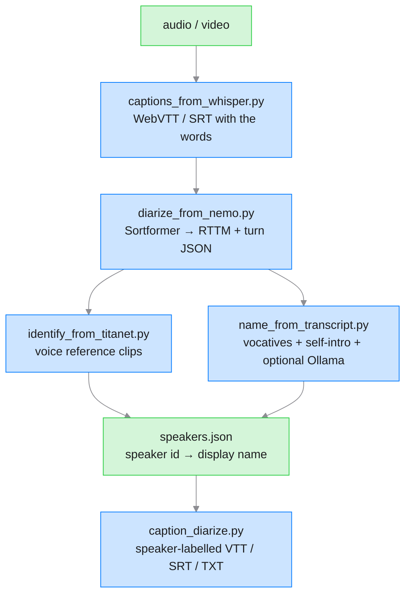

# Speaker diarization + speaker identification

Adds "who spoke when" (Sortformer) and "who is who" (TitaNet or a
transcript-based LLM pass) to the caption stream.

## Pipeline



## Models

| Model | Purpose | Default HF id |
|---|---|---|
| **Sortformer**: end-to-end diarization transformer | "who spoke when" for up to 4 concurrent speakers | `nvidia/diar_sortformer_4spk-v1` |
| **TitaNet-Large**: 192-D speaker-verification embeddings | "who is who" by matching against reference clips | `nvidia/speakerverification_en_titanet_large` |
| **whisper.cpp** (via vocal-helper → pywhispercpp) | captions / transcript | `ggml-large-v3-turbo` |
| **Qwen3-VL** (via Ollama, optional) | name inference from transcript | `qwen3-vl:8b` |

Override any model with `--model` or the matching env var:
`NEMO_DIAR_MODEL`, `NEMO_TITANET_MODEL`, `SPREZZATURE_WHISPER_MODEL`,
`OLLAMA_MODEL` (the one model is `qwen3-vl:8b`).

## Install

```bash
# Base captions tier (already installed if you use captions).
pip install -r scripts/requirements-captions.txt
python scripts/install_captions.py

# Add the diarization tier (heavy — installs NeMo + torch + friends).
pip install -r scripts/requirements-diarize.txt
python scripts/install_diarize.py
```

`install_diarize.py` runs `pip install nemo_toolkit[asr]` if the
package is missing and pre-downloads both checkpoints so the first
real run is not gated on a model fetch. Weights live under
`~/.cache/sprezzature-skill/nemo/`; override with `SPREZZATURE_CACHE_DIR`.

## Run

### Diarize

```bash
# Sortformer on a video file: emits interview.rttm + interview.diarization.json
python scripts/diarize_from_nemo.py interview.mp4

# Cap the speaker count when you know there are two
python scripts/diarize_from_nemo.py call.wav --max-speakers 2

# Force CPU (Apple-silicon MPS is picked automatically otherwise)
python scripts/diarize_from_nemo.py talk.wav --device cpu
```

### Identify with reference clips (TitaNet)

Layout: one WAV per known speaker, filename stem = display name.

```text
voices/
  Alice.wav        # ~5–15 s of clean speech per speaker
  Bob.wav
```

```bash
python scripts/identify_from_titanet.py interview.diarization.json \
    --audio interview.wav \
    --refs ./voices/ \
    --out interview.speakers.json
```

Cosine threshold defaults to `0.55`. Raise it (`--threshold 0.65`) if
the acoustic conditions differ a lot between reference and target
(different mic, phone call vs studio, background music).

### Identify from the transcript (no reference clips needed)

The transcript often names the speakers itself: "Hey Mary,
where were we?", "I'm Alice, product lead at Acme". Two-pass
detector:

* **Rule pass** (fast, offline): regex for self-introduction
  patterns (EN + FR) and turn-initial / turn-final vocatives. Each
  match carries a confidence score; the highest wins per speaker.
* **LLM pass** (opt-in via `--ollama`): sends a compact JSON prompt
  to a local Ollama daemon (same daemon `alt_from_ollama.py` uses).
  Handles ambiguous cases the regex misses.

```bash
# Rule pass only (offline)
python scripts/name_from_transcript.py interview.speakers.vtt \
    --out interview.speakers.json

# Rule pass + local Ollama refinement
python scripts/name_from_transcript.py interview.speakers.vtt --ollama \
    --out interview.speakers.json

# From an un-merged pair
python scripts/name_from_transcript.py interview.vtt \
    --diarization interview.diarization.json \
    --ollama --out interview.speakers.json
```

Prior art the rule pass is modelled on:

* Bäuml, Tapaswi & Stiefelhagen: *Person naming with automatically
  discovered contextual clues* (CVPR 2013).
* Nagrani, Cole & Zisserman: *"From Benedict Cumberbatch to
  Sherlock Holmes"* (BMVC 2017).

Both pair face + subtitle + audio evidence; this skill uses only the
transcript + optional LLM, but the vocative / self-intro cue set is
the same.

### Merge captions + diarization → speaker-labelled transcript

```bash
python scripts/caption_diarize.py \
    --captions interview.vtt \
    --diarization interview.diarization.json \
    --speakers interview.speakers.json \
    --out interview.speakers.vtt
```

The merger picks the diarization turn with the largest overlap for
each caption cue; on ties it prefers the turn whose center is closer
to the cue center. Cues that fall entirely into a silence between
turns inherit the previous speaker's label.

## Output formats

### WebVTT (default): voice cues

```vtt
WEBVTT

00:00:00.000 --> 00:00:03.210
<v Alice>Hello, welcome to the podcast.

00:00:03.210 --> 00:00:07.140
<v Bob>Thanks for having me!
```

WebVTT's `<v Name>` extension is understood by every modern browser
and by common caption-review tools (Amara, Aegisub with the WebVTT
plugin). Renderers without extension support show the plain text.

### SRT: `Name: text` prefix

SRT has no voice-cue extension; the merger prefixes the display name
instead.

```srt
1
00:00:00,000 --> 00:00:03,210
Alice: Hello, welcome to the podcast.

2
00:00:03,210 --> 00:00:07,140
Bob: Thanks for having me!
```

### Plain text: one paragraph per speaker turn

Long pauses (`> 1.5 s`) and speaker changes both introduce a blank
line. Useful for feeding a summariser or a searchable transcript.

## Guardrails

- **Sortformer's four-speaker cap.** The default checkpoint tops out
  at four concurrent speakers. For larger meetings, pull the
  streaming variant (`nvidia/diar_streaming_sortformer_4spk-v2`) or
  the eight-speaker research checkpoints and pass with `--model`.
- **TitaNet is English-first.** Cross-lingual retrieval works but at
  a slightly higher threshold; raise `--threshold` to `0.6`+.
- **Rule pass is a starting point.** Vocatives ("Hey Mary") and
  self-introductions ("I'm Joe") are strong but not universal
  signals. The LLM pass compensates for indirect naming ("as she
  said earlier"); no automatic pass replaces a review.
- **Never invent names.** The LLM prompt says so explicitly; the
  script also refuses any name shorter than three characters or in
  the pronoun / greeting stoplist. Any speaker without evidence
  keeps its anonymous id ("0", "1", …).
- **Diarization is imperfect around overlaps.** Two people speaking
  at the same time will get merged into whoever dominates the
  window. Word-level attribution (Whisper + WhisperX + pyannote) is
  more precise but out of scope for this skill.
